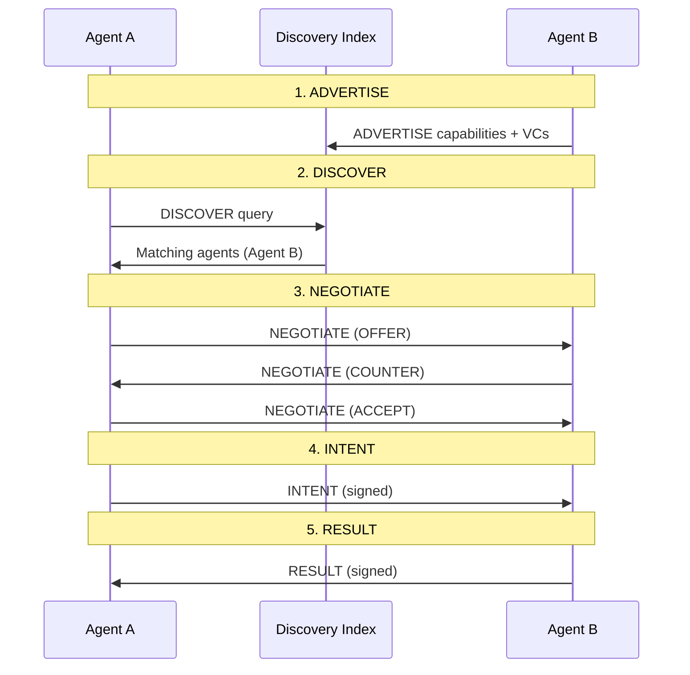

# RFC 001: AI-Native Network Protocol (AINP) v0.1 - Normative Specification

**Status**: Draft
**Authors**: AINP Working Group
**Created**: 2025-10-06
**Version**: 0.1.0

## Abstract

This document specifies the AI-Native Network Protocol (AINP) version 0.1, a semantic communication protocol designed for intent exchange between AI agents. AINP replaces location-based routing with semantic routing, byte-stream delivery with intent delivery, and simple handshakes with multi-round negotiation.

AINP Phase 0.1 provides:
- Wire format specification (JSON-LD + CBOR)
- Message envelope structure with cryptographic signatures
- Intent schemas for common agent interactions
- Semantic address format with Decentralized Identifiers (DIDs)
- Negotiation protocol for multi-agent consensus
- Discovery and routing mechanisms

## 1. Terminology

The key words "MUST", "MUST NOT", "REQUIRED", "SHALL", "SHALL NOT", "SHOULD", "SHOULD NOT", "RECOMMENDED", "MAY", and "OPTIONAL" in this document are to be interpreted as described in RFC 2119.

### Definitions

- **Agent**: An autonomous software entity capable of semantic understanding and intent exchange
- **Intent**: A semantic representation of an agent's goal, including embeddings and structured semantics
- **Semantic Address**: An identity-based address using DIDs and capability descriptors
- **Negotiation**: Multi-round protocol for establishing consensus on resources, terms, and capabilities
- **Capability**: A semantic description of what an agent can do, including natural language and embeddings
- **Trust Vector**: Multi-dimensional reputation score tracking reliability, honesty, competence, and timeliness

## 2. Architecture Overview

AINP consists of four layers:

```
┌─────────────────────────────────────┐
│   Intent Layer                      │  Semantic exchange (intents)
├─────────────────────────────────────┤
│   Negotiation Layer                 │  Multi-agent consensus
├─────────────────────────────────────┤
│   Routing Layer                     │  Semantic routing
├─────────────────────────────────────┤
│   Substrate Layer                   │  Physical transport (TCP/IP, etc.)
└─────────────────────────────────────┘
```

Phase 0.1 runs as an overlay network on TCP/IP with WebSocket or HTTP/3 transport.

## 3. Wire Format

### 3.1 Encoding

AINP messages MUST support both:
- **JSON-LD**: Human-readable, linked data format with `@context` for semantic interoperability
- **CBOR**: Binary encoding (RFC 8949) for efficient transmission

Implementations SHOULD negotiate encoding during handshake. JSON-LD is the default for Phase 0.1.

### 3.2 Message Envelope

All AINP messages MUST be wrapped in an envelope structure:

```typescript
interface AINPEnvelope {
  // Protocol metadata
  version: string,                    // MUST be "0.1.0"
  msg_type: MessageType,              // Message type enum
  id: string,                         // UUID v4
  timestamp: number,                  // Unix epoch milliseconds
  ttl: number,                        // Time-to-live in milliseconds
  trace_id: string,                   // Distributed tracing UUID

  // Routing
  from_did: string,                   // Sender DID (did:key or did:web)
  to_did?: string,                    // Recipient DID (optional)
  to_query?: CapabilityQuery,         // Semantic query (alternative to to_did)

  // Capabilities & attestations
  capabilities_ref?: string,          // URI to Verifiable Credential
  attestations?: string[],            // Array of VC URIs or inline VCs

  // Semantics
  schema: string,                     // JSON-LD context URI

  // Quality of Service
  qos: QoSParameters,

  // Application payload (intent, negotiation, etc.)
  // INCLUDED in signature coverage
  payload?: object,

  // Security
  sig: string                         // Ed25519 signature (base64)
}
```

The signature covers all envelope fields except `sig` itself, including `payload` when present.

### 3.3 Message Types

```typescript
enum MessageType {
  ADVERTISE = "ADVERTISE",   // Publish capabilities to discovery index
  DISCOVER = "DISCOVER",     // Query for agents by capability
  DISCOVER_RESULT = "DISCOVER_RESULT", // Discovery results
  NEGOTIATE = "NEGOTIATE",   // Multi-round negotiation
  INTENT = "INTENT",         // Send intent payload
  RESULT = "RESULT",         // Response with optional proof
  ERROR = "ERROR"            // Error response
}
```

### 3.4 Quality of Service Parameters

```typescript
interface QoSParameters {
  urgency: number,          // 0-1, time sensitivity
  importance: number,       // 0-1, impact magnitude
  novelty: number,         // 0-1, information gain
  ethicalWeight: number,   // 0-1, moral importance
  bid: number              // Token amount or credits (non-negative)
}
```

**Priority Calculation**: Implementations SHOULD calculate message priority as:

```
priority = (urgency × w_urgency) + (importance × w_importance) + (novelty × w_novelty) + (ethicalWeight × w_ethical)
adjusted_priority = priority + 0.5 × tanh(bid / bid_scale)
```

Where `bid_scale` is node-configurable (RECOMMENDED default: 10 credits) and prevents unbounded bid influence.

**Configurable Weights**: The formula above uses default weights optimized for general-purpose agent coordination:
- `w_urgency = 0.3`: Time-sensitive tasks (e.g., emergency alerts, real-time trading)
- `w_importance = 0.3`: High-impact decisions (e.g., approvals, financial contracts)
- `w_novelty = 0.2`: Information discovery (e.g., research queries, exploration)
- `w_ethical = 0.2`: Prosocial behavior (e.g., public goods, charity coordination)

These default weights balance urgency and importance equally (60% combined) while giving moderate consideration to novelty and ethics. The rationale:
- **Urgency + Importance** are critical for practical agent coordination (meetings, approvals, transactions)
- **Novelty** enables exploration and prevents network stagnation (encourages information sharing)
- **Ethical Weight** incentivizes beneficial behavior without overwhelming practical needs

Deployments MAY customize weights based on domain requirements. Examples:

**Emergency Response Network**:
```
w_urgency = 0.6, w_importance = 0.3, w_novelty = 0.05, w_ethical = 0.05
```
Prioritizes time-critical alerts (disaster response, medical emergencies).

**Research & Discovery Network**:
```
w_urgency = 0.1, w_importance = 0.3, w_novelty = 0.5, w_ethical = 0.1
```
Prioritizes novel information sharing (academic collaboration, exploratory agents).

**Financial Trading Network**:
```
w_urgency = 0.5, w_importance = 0.5, w_novelty = 0, w_ethical = 0
```
Prioritizes speed and impact (low-latency trading, no exploration overhead).

**Public Goods Network**:
```
w_urgency = 0.2, w_importance = 0.3, w_novelty = 0.1, w_ethical = 0.4
```
Prioritizes ethical behavior (charity coordination, public service agents).

Custom weights MUST sum to 1.0 and SHOULD be documented in deployment-specific profiles. Implementations MAY expose weight configuration via environment variables or discovery index metadata.

### 3.5 Capability Query

```typescript
interface CapabilityQuery {
  description: string,           // Natural language query
  embedding?: string,            // base64-encoded Float32Array[1536] (optional)
  tags?: string[],              // Filter by capability tags
  min_trust?: number,           // Minimum trust score (0-1)
  max_latency_ms?: number,      // Maximum acceptable latency
  max_cost?: number             // Maximum cost in credits
}
```

### 3.6 Signature Format

Messages MUST be signed using Ed25519 with detached signatures in base64 encoding.

**Signing Process**:
1. Serialize envelope fields (excluding `sig`) to canonical JSON (RFC 8785)
2. Compute SHA-256 hash of canonical JSON
3. Sign hash with Ed25519 private key
4. Encode signature as base64
5. Add `sig` field to envelope

**Verification Process**:
1. Extract `sig` field
2. Remove `sig` from envelope
3. Serialize remaining fields to canonical JSON
4. Compute SHA-256 hash
5. Verify signature using Ed25519 public key from `from_did`

### 3.7 Lite Mode for Resource-Constrained Agents

For lightweight agents (e.g., IoT devices, mobile, embedded systems), implementations MAY use a minimal envelope to reduce payload size and processing overhead.

**Required Fields**:
- `version`, `msg_type`, `id`, `timestamp`, `from_did`, `to_did`, `sig`

**Optional Fields** (MAY be omitted):
- `ttl` (default: 60000ms if not specified)
- `trace_id` (no distributed tracing)
- `to_query` (explicit addressing only, no semantic discovery)
- `capabilities_ref` (no VC attestations)
- `attestations` (trust by DID only)
- `qos` (default: `urgency=0.5, importance=0.5, novelty=0.5, ethicalWeight=0.5, bid=0`)

**Example Lite Envelope**:
```json
{
  "version": "0.1.0",
  "msg_type": "INTENT",
  "id": "550e8400-e29b-41d4-a716-446655440000",
  "timestamp": 1728259400000,
  "from_did": "did:key:z6MkhaXgBZDvotDkL5257faiztiGiC2QtKLGpbnnEGta2doK",
  "to_did": "did:key:z6MkpTHR8VNsBxYAAWHut2Geadd9jSwuBV8xRoAnwWsdvktH",
  "schema": "https://ainp.dev/schemas/intents/request-meeting/v1",
  "sig": "base64sig...",
  "payload": {
    "@context": "https://ainp.dev/contexts/meeting/v1",
    "@type": "RequestMeeting",
    "version": "1.0.0",
    "embedding": { "b64": "CCC/QwAAPkM...", "dim": 384, "dtype": "f32", "model": "sentence-transformers:all-MiniLM-L6-v2" },
    "semantics": { "duration_minutes": 30 },
    "budget": { "max_credits": 5, "max_rounds": 3, "timeout_ms": 15000 }
  }
}
```

**Lite Mode Constraints**:
- Lite mode SHOULD NOT be used for high-stakes intents (e.g., financial transactions, sensitive approvals)
- Agents using lite mode MUST still provide valid Ed25519 signatures
- Discovery indices MAY reject lite mode advertisements (lack of VCs)
- Brokers MAY apply lower trust scores to lite mode agents by default

**When to Use Lite Mode**:
- IoT sensor reporting (SUBMIT_INFO intents with low-value data)
- Mobile agents with limited bandwidth
- High-frequency low-stakes messaging (FREEFORM_NOTE)
- Edge devices with constrained compute (use small embeddings like 384-dim)

## 4. Semantic Addresses

### 4.1 Decentralized Identifiers (DIDs)

Agents MUST have a DID conforming to W3C DID specification.

**Supported DID Methods** (Phase 0.1):
- `did:key:` - Self-certified cryptographic keys
- `did:web:` - Web-based identifiers

Example: `did:key:z6MkpTHR8VNsBxYAAWHut2Geadd9jSwuBV8xRoAnwWsdvktH`

### 4.2 Semantic Address Structure

```typescript
interface SemanticAddress {
  did: string,                         // W3C DID
  capabilities: CapabilityDescriptor[], // What can this agent do?
  trust: TrustVector,                  // Multi-dimensional reputation
  credentials: string[]                // URIs to Verifiable Credentials
}
```

### 4.3 Capability Descriptors

```typescript
interface CapabilityDescriptor {
  description: string,        // Natural language (e.g., "Schedule meetings")
  embedding: Embedding,       // Provider-agnostic embedding
  tags: string[],             // ["scheduling", "calendar", "meeting"]
  version: string,            // Semantic version (e.g., "1.0.0")
  evidence?: string           // URI to Verifiable Credential proving capability
}
```

**Embedding Representation**: Embeddings MUST be provided in a provider-agnostic structure including dimensionality and dtype.

```typescript
interface Embedding {
  b64: string,        // base64 of IEEE 754 float32 array
  dim: number,        // number of dimensions
  dtype: "f32",      // data type (fixed to f32 in v0.1)
  model?: string      // optional model URI or identifier
}
```

**Example**:
```json
{
  "description": "Process insurance claims with 95% accuracy",
  "embedding": { "b64": "AAA/QwAAPkMAAD5D...", "dim": 1536, "dtype": "f32", "model": "openai:text-embedding-3-small" },
  "tags": ["insurance", "claims", "processing"],
  "version": "1.2.0",
  "evidence": "https://credentials.example.com/vc/abc123"
}
```

**Embedding Model Registry**: Implementations MAY use different embedding models. The `model` field in `Embedding` MUST be a URI identifying the model:

- **OpenAI**: `openai:text-embedding-3-small` (1536-dim, default for Phase 0.1)
- **OpenAI Large**: `openai:text-embedding-3-large` (3072-dim)
- **Sentence Transformers**: `sentence-transformers:all-MiniLM-L6-v2` (384-dim)
- **Sentence Transformers Multilingual**: `sentence-transformers:paraphrase-multilingual-MiniLM-L12-v2` (384-dim)
- **Custom**: `https://models.example.com/my-embedder/v1` (dimensions specified in `dim` field)

Discovery indices MUST support at least one model. Cross-model matching SHOULD normalize embeddings or use model-specific similarity thresholds. For cross-model compatibility, implementations MAY use dimensionality reduction (e.g., PCA) or vector space alignment techniques.

**Model Selection Guidance**:
- **Default**: `openai:text-embedding-3-small` (1536-dim) for balance of quality and cost
- **High-accuracy**: `openai:text-embedding-3-large` (3072-dim) for complex semantic matching
- **Low-resource**: `sentence-transformers:all-MiniLM-L6-v2` (384-dim) for IoT/edge devices
- **Multilingual**: `sentence-transformers:paraphrase-multilingual-MiniLM-L12-v2` for global deployments

### 4.4 Trust Vector

```typescript
interface TrustVector {
  score: number,              // 0-1 aggregate trust score
  dimensions: {
    reliability: number,      // Uptime, success rate (0-1)
    honesty: number,         // Reputation, peer reviews (0-1)
    competence: number,      // Task completion quality (0-1)
    timeliness: number       // Response speed (0-1)
  },
  decay_rate: number,        // Exponential decay factor (recommended: 0.977 for 30-day half-life)
  last_updated: number       // Unix epoch milliseconds
}
```

**Trust Score Calculation**:
```
score = (reliability × 0.35) + (honesty × 0.35) + (competence × 0.20) + (timeliness × 0.10)
```

**Trust Decay**: Implementations SHOULD apply exponential decay to trust scores:
```
decayed_score = score × (decay_rate ^ days_since_update)
```

## 5. Intent Schemas

AINP defines six core intent types for Phase 0.1. All intents MUST include:
- JSON-LD `@context` for semantic interoperability
- Embedding (Embedding object; base64 Float32Array inside `b64`)
- Budget constraints
- Semantic payload

### 5.1 REQUEST_MEETING Intent

**Schema URI**: `https://ainp.dev/schemas/intents/request-meeting/v1`

```typescript
interface RequestMeetingIntent {
  "@context": "https://ainp.dev/contexts/meeting/v1",
  "@type": "RequestMeeting",
  version: "1.0.0",

  // Semantic embedding
  embedding: Embedding,

  // Meeting details
  semantics: {
    participants: string[],       // DIDs of participants
    duration_minutes: number,
    preferred_times: string[],    // ISO 8601 datetime strings
    location?: string,           // Physical or virtual location
    agenda?: string,             // Meeting purpose
    constraints: {
      timezone: string,          // IANA timezone (e.g., "America/Los_Angeles")
      max_latency_ms: number,    // Max acceptable response time
      min_notice_hours: number   // Minimum notice required
    }
  },

  // Budget
  budget: {
    max_credits: number,         // Maximum credits willing to spend
    max_rounds: number,          // Max negotiation rounds (default: 10)
    timeout_ms: number           // Overall timeout (default: 30000)
  }
}
```

### 5.2 APPROVAL_REQUEST Intent

**Schema URI**: `https://ainp.dev/schemas/intents/approval-request/v1`

```typescript
interface ApprovalRequestIntent {
  "@context": "https://ainp.dev/contexts/approval/v1",
  "@type": "ApprovalRequest",
  version: "1.0.0",

  embedding: Embedding,

  semantics: {
    request_type: string,        // e.g., "purchase", "travel", "policy_change"
    description: string,         // Human-readable description
    amount?: number,            // Financial amount (if applicable)
    currency?: string,          // ISO 4217 currency code
    justification: string,      // Reasoning for approval
    deadline?: string,          // ISO 8601 datetime
    approvers: string[],        // DIDs of required approvers
    threshold: number,          // Number of approvals needed (1-N)
    constraints: {
      requires_attestation: boolean,  // Require signed VC
      max_latency_ms: number
    }
  },

  budget: {
    max_credits: number,
    max_rounds: number,
    timeout_ms: number
  }
}
```

### 5.3 SUBMIT_INFO Intent

**Schema URI**: `https://ainp.dev/schemas/intents/submit-info/v1`

```typescript
interface SubmitInfoIntent {
  "@context": "https://ainp.dev/contexts/submit-info/v1",
  "@type": "SubmitInfo",
  version: "1.0.0",

  embedding: Embedding,

  semantics: {
    data_type: string,           // e.g., "form", "document", "sensor_reading"
    payload: Record<string, any>, // Structured data
    schema_ref?: string,         // URI to JSON Schema
    privacy_level: "public" | "encrypted" | "confidential",
    retention_policy?: {
      duration_days: number,
      delete_after: boolean
    },
    constraints: {
      requires_acknowledgment: boolean,
      max_latency_ms: number
    }
  },

  budget: {
    max_credits: number,
    max_rounds: number,
    timeout_ms: number
  }
}
```

### 5.4 INVOICE Intent

**Schema URI**: `https://ainp.dev/schemas/intents/invoice/v1`

```typescript
interface InvoiceIntent {
  "@context": "https://ainp.dev/contexts/invoice/v1",
  "@type": "Invoice",
  version: "1.0.0",

  embedding: Embedding,

  semantics: {
    invoice_id: string,
    from: string,               // DID of issuer
    to: string,                 // DID of payer
    amount: string,             // String to avoid precision loss
    currency: string,           // ISO 4217 or token identifier
    line_items: Array<{
      description: string,
      quantity: number,
      unit_price: string,
      total: string
    }>,
    due_date: string,           // ISO 8601
    payment_methods: string[],  // ["crypto", "wire", "credit"]
    constraints: {
      requires_escrow: boolean,
      max_latency_ms: number
    }
  },

  budget: {
    max_credits: number,
    max_rounds: number,
    timeout_ms: number
  }
}
```

### 5.5 FREEFORM_NOTE Intent

**Schema URI**: `https://ainp.dev/schemas/intents/freeform-note/v1`

```typescript
interface FreeformNoteIntent {
  "@context": "https://ainp.dev/contexts/freeform/v1",
  "@type": "FreeformNote",
  version: "1.0.0",

  embedding: Embedding,           // Embedding of message content

  semantics: {
    subject?: string,
    body: string,                // Main content
    format: "plaintext" | "markdown" | "html",
    attachments?: Array<{
      url: string,
      mime_type: string,
      size_bytes: number,
      hash: string              // SHA-256 hash (base64)
    }>,
    thread_id?: string,          // For threaded conversations
    in_reply_to?: string,        // Message ID being replied to
    constraints: {
      max_latency_ms: number
    }
  },

  budget: {
    max_credits: number,
    max_rounds: number,
    timeout_ms: number
  }
}
```

### 5.6 REQUEST_SERVICE Intent

**Schema URI**: `https://ainp.dev/schemas/intents/request-service/v1`

```typescript
interface RequestServiceIntent {
  "@context": "https://ainp.dev/contexts/service/v1",
  "@type": "RequestService",
  version: "1.0.0",

  embedding: Embedding,

  semantics: {
    service_type: string,        // e.g., "plumbing.leak.fix"
    geo?: {
      lat?: number,
      lon?: number,
      radiusKm?: number,
      zip?: string
    },
    time_window?: {
      earliest: string,          // ISO 8601 datetime
      latest: string             // ISO 8601 datetime
    },
    constraints?: {
      eco?: boolean,
      access_notes?: string,     // Entry/parking, etc.
      evidence_required?: string[]
    },
    details?: Record<string, any>
  },

  budget: {
    max_credits: number,         // Max agent/network credits
    max_total?: number,          // Max total price for service
    escrow_required?: boolean,
    max_rounds: number,
    timeout_ms: number
  }
}
```

## 6. Negotiation Protocol

### 6.1 Negotiation Flow

Negotiation MUST follow this state machine:

```
START → OFFER → COUNTER ↔ COUNTER → ACCEPT
                  ↓         ↓
                ABORT     TIMEOUT
                  ↓         ↓
                REJECT    REJECT
```

### 6.2 Negotiation Message Structure

```typescript
interface NegotiationMessage {
  negotiation_id: string,        // UUID for this negotiation session
  round: number,                 // Current round (1-indexed)
  phase: NegotiationPhase,
  proposal: Proposal,
  constraints: NegotiationConstraints
}

enum NegotiationPhase {
  OFFER = "OFFER",           // Initial offer
  COUNTER = "COUNTER",       // Counter-offer
  ACCEPT = "ACCEPT",         // Accept proposal
  REJECT = "REJECT",         // Reject and end
  ABORT = "ABORT",           // Abort negotiation
  TIMEOUT = "TIMEOUT"        // Timeout occurred
}

interface Proposal {
  price: number,              // Credits for service
  latency_ms: number,        // Expected response time
  confidence: number,        // 0-1 success probability
  privacy: "encrypted" | "public",
  terms: Record<string, any>  // Custom terms (extensible)
}

interface NegotiationConstraints {
  max_rounds: number,              // Maximum rounds (default: 10)
  timeout_per_round_ms: number,    // Timeout per round (default: 5000)
  convergence_threshold: number    // 0-1, when to auto-accept (default: 0.9)
}
```

Implementations SHOULD recognize the following common `proposal.terms` keys:
- `incentive_split`: object describing base shares and caps per role
- `escrow_required`: boolean indicating escrow is required prior to ACCEPT
- `escrow_ref`: string reference to escrow transaction or reservation
- `window`: ISO 8601 interval (e.g., service time window)
- `evidence_required`: array of strings indicating required attestations (e.g., `photo_before_after`, `license_vc`)

Defaults: If absent, implementations MUST apply defaults of `max_rounds=10`, `timeout_per_round_ms=5000`, and `convergence_threshold=0.9`.

### 6.3 Negotiation Convergence

Implementations MAY auto-accept proposals when convergence threshold is met:

```
convergence_score = 1 - (abs(offer.price - counter.price) / max(offer.price, counter.price))

if convergence_score >= convergence_threshold:
  auto_accept()
```

### 6.4 Timeout Behavior

- **Per-round timeout**: If no response within `timeout_per_round_ms`, sender MAY send TIMEOUT message
- **Overall timeout**: If negotiation exceeds `max_rounds × timeout_per_round_ms`, MUST terminate with TIMEOUT

### 6.5 Multi-Party Negotiation (3+ Agents)

For intents involving multiple agents (e.g., scheduling a meeting with 5 participants, multi-signature approvals), negotiation MUST support group consensus mechanisms.

**Group Proposal Structure**:
```typescript
interface GroupProposal {
  participants: string[],              // DIDs of all participating agents
  individual_proposals: Map<string, Proposal>,  // Each agent's proposal (keyed by DID)
  voting_mechanism: VotingMechanism,
  convergence_threshold: number        // 0-1, minimum agreement score for auto-accept
}

enum VotingMechanism {
  UNANIMOUS = "unanimous",   // All agents must ACCEPT (default for high-stakes)
  MAJORITY = "majority",     // >50% must ACCEPT
  WEIGHTED = "weighted"      // Votes weighted by trust scores
}
```

**Voting Mechanisms**:

1. **Unanimous** (default for high-stakes intents):
   - All agents must ACCEPT the proposal
   - Single REJECT causes negotiation to continue or ABORT
   - Use for: financial transactions, legal agreements, critical approvals

2. **Majority** (democratic consensus):
   - More than 50% of participants must ACCEPT
   - Minority REJECT votes are ignored
   - Use for: scheduling with optional participants, polls, non-critical decisions

3. **Weighted** (trust-based consensus):
   - Each vote is weighted by agent's trust score
   - Acceptance condition: `sum(trust_score × vote) >= convergence_threshold`
   - Vote values: ACCEPT = 1, REJECT = 0, ABSTAIN = 0.5
   - Use for: expert panels, reputation-based governance

**Multi-Party Negotiation Flow**:

1. **Fan-out**: Initiating agent or broker sends NEGOTIATE(OFFER) to all participants
2. **Collection**: Each agent responds with individual proposal (price, latency, terms)
3. **Aggregation**: Broker aggregates proposals and computes consensus score
4. **Convergence Check**:
   ```
   convergence_score = (accepting_agents / total_agents)  // For unanimous/majority
   convergence_score = sum(trust[i] × vote[i]) / sum(trust[i])  // For weighted
   ```
5. **Auto-accept**: If `convergence_score >= convergence_threshold`, broker sends ACCEPT to all
6. **Iteration**: If not converged, broker synthesizes counter-proposal (e.g., median of proposals) and repeats
7. **Termination**: After `max_rounds` or timeout, broker sends ABORT if no consensus

**Example**: Schedule a 3-agent meeting:
```json
{
  "negotiation_id": "multi-abc123",
  "phase": "OFFER",
  "proposal": {
    "participants": ["did:key:agent-a", "did:key:agent-b", "did:key:agent-c"],
    "voting_mechanism": "majority",
    "convergence_threshold": 0.75,
    "terms": {
      "preferred_times": ["2025-10-07T14:00:00Z", "2025-10-07T15:00:00Z"],
      "duration_minutes": 30
    }
  }
}
```

Agent responses:
- Agent A: ACCEPT (prefers 14:00)
- Agent B: ACCEPT (prefers 15:00)
- Agent C: COUNTER (only available 16:00)

Convergence: 2/3 = 0.67 < 0.75 (threshold not met, continue negotiation)

Broker synthesizes counter with all three time slots, agents re-negotiate.

**Complexity Management**:
- Multi-party negotiation is O(participants × rounds), so `max_rounds` SHOULD be reduced for large groups
- RECOMMENDED: `max_rounds = min(10, 20 / participants)` (e.g., 5 rounds for 4 participants)
- For groups >10 participants, consider hierarchical negotiation (sub-groups elect representatives)

**Optimization: Consensus Prediction**:
- Brokers MAY use historical data to predict likely consensus and pre-filter proposals
- Agents MAY provide "acceptable ranges" (e.g., "any time between 14:00-16:00") to speed convergence

## 7. Protocol Handshake Sequence

### 7.1 Five-Step Handshake



### 7.2 ADVERTISE Phase

Agent B publishes capabilities to discovery index:

```json
{
  "version": "0.1.0",
  "msg_type": "ADVERTISE",
  "id": "550e8400-e29b-41d4-a716-446655440000",
  "timestamp": 1728259200000,
  "ttl": 86400000,
  "trace_id": "trace-abc123",
  "from_did": "did:key:z6MkpTHR8VNsBxYAAWHut2Geadd9jSwuBV8xRoAnwWsdvktH",
  "schema": "https://ainp.dev/schemas/advertise/v1",
  "qos": {
    "urgency": 0.1,
    "importance": 0.5,
    "novelty": 0.3,
    "ethicalWeight": 0.5,
    "bid": 0
  },
  "sig": "base64signature...",
  "payload": {
    "capabilities": [
      {
        "description": "Schedule meetings with calendar integration",
        "embedding": "AAA/QwAAPkM...",
        "tags": ["scheduling", "calendar"],
        "version": "1.0.0",
        "evidence": "https://credentials.example.com/vc/scheduling"
      }
    ],
    "trust": {
      "score": 0.85,
      "dimensions": {
        "reliability": 0.9,
        "honesty": 0.85,
        "competence": 0.8,
        "timeliness": 0.85
      },
      "decay_rate": 0.977,
      "last_updated": 1728259200000
    },
    "credentials": ["https://credentials.example.com/vc/scheduling"]
  }
}
```

### 7.3 DISCOVER Phase

Agent A queries for capabilities:

```json
{
  "version": "0.1.0",
  "msg_type": "DISCOVER",
  "id": "660e8400-e29b-41d4-a716-446655440001",
  "timestamp": 1728259300000,
  "ttl": 10000,
  "trace_id": "trace-def456",
  "from_did": "did:key:z6MkhaXgBZDvotDkL5257faiztiGiC2QtKLGpbnnEGta2doK",
  "to_query": {
    "description": "Find agents who can schedule meetings",
    "embedding": "BBB/QwAAPkM...",
    "tags": ["scheduling", "calendar"],
    "min_trust": 0.7,
    "max_latency_ms": 5000,
    "max_cost": 10
  },
  "schema": "https://ainp.dev/schemas/discover/v1",
  "qos": {
    "urgency": 0.5,
    "importance": 0.7,
    "novelty": 0.2,
    "ethicalWeight": 0.5,
    "bid": 1
  },
  "sig": "base64signature..."
}
```

Discovery index responds with matching agents using `DISCOVER_RESULT`:

```json
{
  "version": "0.1.0",
  "msg_type": "DISCOVER_RESULT",
  "id": "770e8400-e29b-41d4-a716-446655440099",
  "timestamp": 1728259305000,
  "ttl": 10000,
  "trace_id": "trace-def456",
  "from_did": "did:web:index.local",
  "to_did": "did:key:z6MkhaXgBZDvotDkL5257faiztiGiC2QtKLGpbnnEGta2doK",
  "schema": "https://ainp.dev/schemas/discover-result/v1",
  "qos": { "urgency": 0.5, "importance": 0.7, "novelty": 0.2, "ethicalWeight": 0.5, "bid": 0 },
  "sig": "base64signature...",
  "payload": {
    "matches": [
      {
        "did": "did:key:zPlumbEr1...",
        "score": 0.86,
        "trust": { "score": 0.9 },
        "estLatencyMs": 1200,
        "distanceKm": 6.2,
        "priceHint": 120
      },
      {
        "did": "did:key:zPlumbEr2...",
        "score": 0.82,
        "trust": { "score": 0.88 },
        "estLatencyMs": 1500,
        "distanceKm": 8.0
      }
    ]
  }
}
```

### 7.4 NEGOTIATE Phase

See Section 6.2 for negotiation message structure.

### 7.5 INTENT Phase

Agent A sends intent after successful negotiation:

```json
{
  "version": "0.1.0",
  "msg_type": "INTENT",
  "id": "770e8400-e29b-41d4-a716-446655440002",
  "timestamp": 1728259400000,
  "ttl": 30000,
  "trace_id": "trace-ghi789",
  "from_did": "did:key:z6MkhaXgBZDvotDkL5257faiztiGiC2QtKLGpbnnEGta2doK",
  "to_did": "did:key:z6MkpTHR8VNsBxYAAWHut2Geadd9jSwuBV8xRoAnwWsdvktH",
  "schema": "https://ainp.dev/schemas/intents/request-meeting/v1",
  "qos": {
    "urgency": 0.7,
    "importance": 0.8,
    "novelty": 0.1,
    "ethicalWeight": 0.5,
    "bid": 5
  },
  "sig": "base64signature...",
  "payload": {
    "@context": "https://ainp.dev/contexts/meeting/v1",
    "@type": "RequestMeeting",
    "version": "1.0.0",
    "embedding": { "b64": "CCC/QwAAPkM...", "dim": 1536, "dtype": "f32", "model": "openai:text-embedding-3-small" },
    "semantics": {
      "participants": [
        "did:key:z6MkhaXgBZDvotDkL5257faiztiGiC2QtKLGpbnnEGta2doK",
        "did:key:z6MkpTHR8VNsBxYAAWHut2Geadd9jSwuBV8xRoAnwWsdvktH"
      ],
      "duration_minutes": 30,
      "preferred_times": [
        "2025-10-07T14:00:00Z",
        "2025-10-07T15:00:00Z"
      ],
      "location": "virtual",
      "constraints": {
        "timezone": "America/Los_Angeles",
        "max_latency_ms": 5000,
        "min_notice_hours": 24
      }
    },
    "budget": {
      "max_credits": 10,
      "max_rounds": 5,
      "timeout_ms": 30000
    }
  }
}
```

### 7.6 RESULT Phase

Agent B responds with result:

```json
{
  "version": "0.1.0",
  "msg_type": "RESULT",
  "id": "880e8400-e29b-41d4-a716-446655440003",
  "timestamp": 1728259410000,
  "ttl": 60000,
  "trace_id": "trace-ghi789",
  "from_did": "did:key:z6MkpTHR8VNsBxYAAWHut2Geadd9jSwuBV8xRoAnwWsdvktH",
  "to_did": "did:key:z6MkhaXgBZDvotDkL5257faiztiGiC2QtKLGpbnnEGta2doK",
  "schema": "https://ainp.dev/schemas/results/v1",
  "qos": {
    "urgency": 0.7,
    "importance": 0.8,
    "novelty": 0.1,
    "ethicalWeight": 0.5,
    "bid": 0
  },
  "sig": "base64signature...",
  "payload": {
    "intent_id": "770e8400-e29b-41d4-a716-446655440002",
    "status": "success",
    "result": {
      "meeting_scheduled": true,
      "confirmed_time": "2025-10-07T14:00:00Z",
      "calendar_link": "https://calendar.example.com/events/abc123"
    },
    "attestations": [
      "https://credentials.example.com/vc/meeting-proof"
    ],
    "metadata": {
      "processing_time_ms": 250,
      "confidence": 0.95
    }
  }
}
```

### 7.7 ERROR Phase

On error, agent MUST respond with ERROR message:

```typescript
interface ErrorMessage {
  msg_type: "ERROR",
  error_code: string,          // e.g., "TIMEOUT", "INVALID_SCHEMA", "INSUFFICIENT_CREDITS"
  error_message: string,       // Human-readable description
  intent_id?: string,          // Reference to failed intent
  retry_after_ms?: number      // Suggested retry delay
}
```

#### 7.7.1 Standard Error Codes

Implementations MUST use the following error codes where applicable:
- `INVALID_SIGNATURE`
- `UNAUTHORIZED`
- `UNSUPPORTED_SCHEMA`
- `TIMEOUT`
- `RATE_LIMIT_EXCEEDED`
- `INSUFFICIENT_CREDITS`
- `NEGOTIATION_FAILED`
- `ESCROW_REQUIRED`
- `EVIDENCE_INSUFFICIENT`
- `DUPLICATE_INTENT`
- `AGENT_OFFLINE` (recipient agent unreachable)
- `INTERNAL_ERROR`

### 7.8 Offline Intent Queueing

When recipient agent is offline or unreachable, broker MAY queue intents for later delivery instead of immediately failing.

**Queue Behavior**:
- TTL enforcement: Intent expires after `ttl` milliseconds from original `timestamp`
- Broker SHOULD send ERROR to sender immediately: `error_code: "AGENT_OFFLINE"`
- ERROR response SHOULD include `retry_after_ms` field indicating when agent expected back online
- Broker MUST NOT queue intents indefinitely (maximum queue time = `ttl`)

**Persistent Queue Structure** (OPTIONAL):
```typescript
interface QueuedIntent {
  intent_id: string,              // Original intent UUID
  envelope: AINPEnvelope,         // Full envelope (including payload and signature)
  queued_at: number,              // Unix epoch ms when queued
  expires_at: number,             // timestamp + ttl
  retry_count: number,            // Number of delivery attempts
  max_retries: number,            // Maximum retry attempts (default: 3)
  priority: number                // Calculated from QoS (for queue ordering)
}
```

**Database Schema** (PostgreSQL example):
```sql
CREATE TABLE intent_queue (
  id UUID PRIMARY KEY DEFAULT gen_random_uuid(),
  intent_id UUID NOT NULL,
  to_did TEXT NOT NULL,
  envelope JSONB NOT NULL,           -- Full AINP envelope
  queued_at TIMESTAMPTZ DEFAULT NOW(),
  expires_at TIMESTAMPTZ NOT NULL,   -- queued_at + ttl
  retry_count INT DEFAULT 0,
  max_retries INT DEFAULT 3,
  priority NUMERIC(3, 2) DEFAULT 0.5, -- QoS-derived priority (0-1)
  last_retry_at TIMESTAMPTZ,
  INDEX idx_to_did_expires (to_did, expires_at),
  INDEX idx_expires_priority (expires_at, priority DESC)
);
```

**Queue Delivery Protocol**:

1. **Agent Offline Detection**: Broker detects agent offline (connection timeout, heartbeat failure)
2. **Queue Intent**: Insert into `intent_queue` with `expires_at = timestamp + ttl`
3. **Send ERROR**: Immediately notify sender with `AGENT_OFFLINE` and `retry_after_ms`
4. **Agent Reconnect**: When agent comes online, broker delivers queued intents in priority order
5. **Delivery Ordering**: Process queue as FIFO within each priority level (higher QoS priority first)
6. **Retry Logic**: If delivery fails, increment `retry_count` and retry after exponential backoff
7. **Expiration Cleanup**: Periodically purge expired intents (`expires_at < NOW()`)

**Example ERROR Response** (agent offline):
```json
{
  "msg_type": "ERROR",
  "error_code": "AGENT_OFFLINE",
  "error_message": "Recipient agent did:key:z6Mk... is currently offline. Intent queued for delivery.",
  "intent_id": "770e8400-e29b-41d4-a716-446655440002",
  "retry_after_ms": 300000,  // Retry in 5 minutes
  "queued": true,
  "expires_at": 1728289400000  // Intent expires at this timestamp
}
```

**Queue Management Operations**:
- **Peek**: Sender MAY query queue status for their intents (requires authentication)
- **Cancel**: Sender MAY cancel queued intent before delivery (requires signature verification)
- **Flush**: Agent coming online triggers flush of all queued intents for that DID

**Rate Limiting for Queued Intents**:
- Brokers SHOULD apply rate limits when delivering queued intents (prevent flood on reconnect)
- RECOMMENDED: Deliver at most 10 intents/second per agent when flushing queue
- High-priority intents (QoS urgency >0.8) MAY bypass rate limits

**Security Considerations**:
- Queued intents MUST maintain original signature (replay protection)
- Brokers MUST NOT modify envelope contents while queued
- Queue storage SHOULD be encrypted at rest (protect sensitive payloads)
- Queue access MUST be authenticated (only broker and authorized sender can query)

**When NOT to Queue**:
- High-urgency intents with very short TTL (<5 seconds)
- Intents explicitly marked `no_queue: true` in metadata
- Broadcast intents (no single recipient)
- Intents that require immediate response (real-time trading, emergency alerts)

## 8. Security Requirements

### 8.1 Authentication

- All messages MUST be signed with Ed25519
- Signatures MUST be verifiable using public key from `from_did`
- Unsigned messages MUST be rejected

### 8.2 Identity

- Agents MUST have a valid W3C DID
- DIDs MUST be resolvable to DID documents containing public keys
- Supported methods: `did:key`, `did:web`

### 8.3 Capability Attestations

- Agents advertising capabilities SHOULD provide Verifiable Credentials (VCs)
- VCs MUST conform to W3C Verifiable Credentials Data Model 1.1
- Discovery indices MAY reject advertisements without VCs

### 8.4 Rate Limiting

Implementations MUST enforce rate limits:
- **Default**: 100 intents per minute per agent
- **Burst**: Up to 200 intents in 10-second window
- **Discovery queries**: 10 per minute per agent

Rate limit violations MUST result in ERROR response with `error_code: "RATE_LIMIT_EXCEEDED"`.

### 8.5 Timeouts

- **Intent delivery**: 60 seconds default TTL
- **Negotiation per round**: 5 seconds default
- **Overall negotiation**: 30 seconds default
- **Discovery query**: 10 seconds default

### 8.6 Outlier Detection

Discovery indices SHOULD flag agents with:
- Trust score < 0.3
- Capability embeddings >3σ from cluster mean (potential false advertising)
- Success rate < 50% over last 100 intents

### 8.7 DoS Protection

Implementations MUST:
- Validate message signatures before processing
- Enforce TTL (drop expired messages)
- Limit negotiation rounds (max 10)
- Reject messages exceeding 1MB payload size
- Require attachments by reference (URLs) rather than inlining large binaries

### 8.8 Replay Protection and Delivery Semantics

- Recipients MUST reject duplicate messages with the same `(from_did, id)` seen within `ttl + 60000ms` (to account for retries and skew).
- Implementations MUST allow a clock skew of ±60000ms when validating `timestamp`.
- At-least-once delivery is RECOMMENDED; senders MUST use UUID v4 `id`s and recipients MUST make intent handling idempotent with respect to `id`.

### 8.9 Discovery Scalability

**Phase 0.1 Architecture**: Centralized discovery index using PostgreSQL with pgvector extension for semantic search.

**Vector Indexing**: Discovery indices SHOULD use Approximate Nearest Neighbor (ANN) indexing for efficient semantic search at scale:

**Recommended Algorithm**: HNSW (Hierarchical Navigable Small World)
- **Structure**: Multi-layer graph with hierarchical routing
- **Parameters**:
  - `m = 16`: Connections per layer (default, balances accuracy vs. memory)
  - `ef_construction = 64`: Search scope during index build (higher = better accuracy, slower build)
  - `ef_search = 40`: Search scope during query (higher = better accuracy, slower search)
- **Distance Metric**: Cosine similarity (or dot product for normalized vectors)
- **Performance**: ~10ms search latency for 1M agents, ~99% recall with default parameters
- **Memory**: ~200 bytes per vector (for 1536-dim embeddings with m=16)

**pgvector Implementation** (PostgreSQL extension):
```sql
CREATE EXTENSION vector;

CREATE TABLE agent_capabilities (
  id UUID PRIMARY KEY,
  agent_did TEXT NOT NULL,
  capability_desc TEXT,
  embedding vector(1536),  -- Dimension matches embedding model
  tags TEXT[],
  trust_score NUMERIC(3, 2),
  last_updated TIMESTAMPTZ DEFAULT NOW()
);

-- Create HNSW index for fast similarity search
CREATE INDEX ON agent_capabilities
USING hnsw (embedding vector_cosine_ops)
WITH (m = 16, ef_construction = 64);

-- Query for similar capabilities (k=10 nearest neighbors)
SELECT agent_did, capability_desc,
       1 - (embedding <=> query_vector) AS similarity
FROM agent_capabilities
WHERE trust_score >= 0.7
ORDER BY embedding <=> query_vector
LIMIT 10;
```

**Scaling Strategies**:

1. **Vertical Scaling** (single-node optimization):
   - Increase HNSW parameters: `m=32, ef_construction=128` for better accuracy
   - Trade-off: 2x memory usage, 1.5x slower index build, 1.2x slower search
   - Use NVMe SSDs for index storage (reduce I/O bottleneck)
   - Scale PostgreSQL memory (increase `shared_buffers` to 25% of RAM)

2. **Horizontal Scaling** (multi-node):
   - **Read Replicas**: PostgreSQL read replicas for discovery queries (write-once, read-many pattern)
   - **Connection Pooling**: PgBouncer for connection management (1000+ concurrent queries)
   - **Caching Layer**: Redis cache for frequent queries (5-minute TTL)

3. **Partitioning** (domain-specific indices):
   - **Capability Sharding**: Separate tables by capability cluster (e.g., `scheduling_agents`, `payment_agents`)
   - **Tag-based Routing**: Route queries to relevant shard based on query tags
   - **Geographic Partitioning**: Separate indices per region (reduce latency for local queries)

4. **Query Optimization**:
   - **Pre-filtering**: Filter by `trust_score`, `tags`, `last_updated` before vector search
   - **Batch Queries**: Combine multiple discovery queries into single request
   - **Approximate Search**: Trade recall for speed (use lower `ef_search` for large result sets)

**Performance Benchmarks** (Phase 0.1 targets):

| Agent Count | Index Size | Build Time | Query Latency (p95) | Recall@10 |
|-------------|------------|------------|---------------------|-----------|
| 1K          | 2 MB       | 5s         | 2ms                 | 99.5%     |
| 10K         | 20 MB      | 45s        | 5ms                 | 99.2%     |
| 100K        | 200 MB     | 8 min      | 12ms                | 98.8%     |
| 1M          | 2 GB       | 90 min     | 25ms                | 98.0%     |

**Query Caching** (Redis):
```typescript
interface CachedDiscoveryResult {
  query_hash: string,           // SHA-256(query_embedding + tags + min_trust)
  results: Array<{
    did: string,
    score: number,
    trust: number
  }>,
  cached_at: number,            // Unix epoch ms
  ttl: number                   // 300000ms (5 minutes)
}
```

Implementations SHOULD cache discovery results to reduce vector search load:
- Cache key: Hash of query embedding + filters
- TTL: 5 minutes (balance freshness vs. performance)
- Invalidation: Clear cache on ADVERTISE (new agent capabilities)

**Phase 1+ (Future): Decentralized Discovery**:

1. **Gossip Protocol** (epidemic broadcast):
   - Agents broadcast capability advertisements to peers
   - Exponential propagation (each agent forwards to `log(n)` peers)
   - Probabilistic routing (agents maintain partial view of network)

2. **DHT (Distributed Hash Table)**:
   - Kademlia-based routing (O(log n) lookups)
   - Capability keys hashed into DHT keyspace
   - Replication factor: 3-5 nodes per capability

3. **Hybrid Architecture**:
   - Centralized index for fast queries (Phase 0.1 compatibility)
   - DHT for decentralization and resilience
   - Cross-index federation (multiple discovery providers)

**Scalability Limits** (Phase 0.1):
- **Target**: 10K-100K agents (production-ready)
- **Maximum**: 1M agents (with vertical scaling and optimizations)
- **Beyond 1M**: Requires Phase 1 decentralized architecture

## 9. Success Metrics

### 9.1 Route Success Rate

```
route_success_rate = (intents_delivered_correctly / total_intents_sent) × 100%
```

**Target (Phase 0.1)**: ≥95%

### 9.2 Latency (p95)

95th percentile time from INTENT sent to RESULT received.

**Target (Phase 0.1)**: ≤2000ms

### 9.3 Negotiation Completion Rate

```
negotiation_completion_rate = (negotiations_accepted / total_negotiations) × 100%
```

**Target (Phase 0.1)**: ≥80%

### 9.4 False Route Rate

```
false_route_rate = (intents_misrouted / total_intents_sent) × 100%
```

**Target (Phase 0.1)**: ≤5%

### 9.5 Abuse Resilience

Detection rate of:
- DoS attacks (>1000 requests/min from single agent)
- Sybil attacks (multiple DIDs from same source)
- False capability advertising (capability mismatch >0.5 cosine distance)

**Target (Phase 0.1)**: ≥90% detection rate

## 10. CBOR Encoding (Optional)

For efficiency, implementations MAY use CBOR (RFC 8949) encoding:

**Mapping**:
- `AINPEnvelope` → CBOR map with integer keys (see Key Map)
- `embedding` → CBOR byte string (raw float32 array for `Embedding.b64`)
- `timestamp` → CBOR unsigned integer
- `sig` → CBOR byte string

**Key Map (v0.1)**:

```
1: version
2: msg_type
3: id               // byte string (UUID bytes) or text UUID
4: timestamp
5: ttl
6: trace_id
7: from_did
8: to_did
9: to_query
10: schema
11: qos
12: capabilities_ref
13: attestations
14: payload
15: sig             // byte string
```

**Example** (pseudo-CBOR):
```
{
  1: "0.1.0",           // version
  2: "INTENT",          // msg_type
  3: h'550e8400e29b41d4a716446655440002', // id (UUID bytes)
  4: 1728259400000,     // timestamp
  5: 30000,             // ttl
  6: "trace-ghi789",    // trace_id
  7: "did:key:...",     // from_did
  8: "did:key:...",     // to_did
  9: "https://...",     // schema
  10: {...},            // qos
  14: {...},            // payload
  15: h'8f3a...'
}
```

CBOR encoding SHOULD be negotiated during ADVERTISE or DISCOVER phase.

## 11. Extensibility

### 11.1 Custom Intent Types

Agents MAY define custom intent types beyond the core set. Custom intents MUST:
- Include `@context` with unique URI
- Include `version` field
- Include `embedding` field
- Include `budget` constraints
- Register schema URI in public registry (future)

### 11.2 Custom Negotiation Terms

`Proposal.terms` field allows extensible negotiation parameters. Common extensions:
- `privacy_guarantees`: ZK proof requirements
- `sla_guarantees`: Service level agreements
- `data_retention`: Data retention policies

### 11.3 Versioning

AINP uses semantic versioning. Breaking changes MUST increment major version. Phase 0.1 is backwards-compatible within 0.x series.

### 11.4 Lite Profile (Trusted Networks)

In trusted or closed-network deployments, the following simplifications are PERMITTED:
- Omit `capabilities_ref` and `attestations` if peers are pre-authorized; apply stricter rate limits.
- Prefer JSON-LD for small payloads; negotiate CBOR for payloads > 4KB.
- Allow `to_query`-only routing within a single administrative domain without public discovery.

Nodes MUST still sign messages, enforce TTLs, and implement replay protection.

## 12. References

- **RFC 2119**: Key words for use in RFCs to Indicate Requirement Levels
- **RFC 8785**: JSON Canonicalization Scheme (JCS)
- **RFC 8949**: Concise Binary Object Representation (CBOR)
- **W3C DID**: Decentralized Identifiers 1.0
- **W3C VC**: Verifiable Credentials Data Model 1.1
- **JSON-LD 1.1**: JSON-based Serialization for Linked Data
- **Ed25519**: High-speed high-security signatures

## Appendix A: Complete Wire Format Example

See Section 7.5 (INTENT Phase) for complete JSON-LD envelope example.

## Appendix B: Embedding Generation

**Recommended Model**: OpenAI `text-embedding-3-small` (example). Any provider MAY be used if `Embedding` contract is satisfied.

```python
import openai
import base64
import struct

def generate_embedding(text: str) -> dict:
    response = openai.embeddings.create(
        model="text-embedding-3-small",
        input=text
    )
    embedding = response.data[0].embedding  # List of 1536 floats

    # Encode as float32 array
    float32_bytes = struct.pack(f'{len(embedding)}f', *embedding)

    # Base64 encode
    b64 = base64.b64encode(float32_bytes).decode('utf-8')
    return {"b64": b64, "dim": len(embedding), "dtype": "f32", "model": "openai:text-embedding-3-small"}

# Usage
embedding = generate_embedding("Schedule a meeting with Bob tomorrow at 2pm")
```

## Appendix C: Cosine Similarity for Semantic Routing

Discovery indices SHOULD use cosine similarity for matching capability queries:

```python
import numpy as np

def cosine_similarity(embedding_a: np.ndarray, embedding_b: np.ndarray) -> float:
    return np.dot(embedding_a, embedding_b) / (
        np.linalg.norm(embedding_a) * np.linalg.norm(embedding_b)
    )

# Match if similarity > threshold (e.g., 0.7)
similarity = cosine_similarity(query_embedding, capability_embedding)
if similarity >= 0.7:
    return agent
```

## Appendix D: Credit System (Phase 0.1)

AINP Phase 0.1 uses an **off-chain credit ledger** for economic incentives and resource allocation. Blockchain settlement is deferred to Phase 2 for simplicity and performance.

### D.1 Credit Account Structure

```typescript
interface CreditAccount {
  agent_id: string,           // Agent DID
  balance: string,            // String to avoid floating-point precision loss (e.g., "1000.50")
  total_earned: string,       // Lifetime earnings (cumulative)
  total_spent: string,        // Lifetime spending (cumulative)
  reserved: string,           // Credits reserved for pending intents (escrow)
  last_updated: number        // Unix epoch ms (timestamp of last transaction)
}
```

**Database Schema** (PostgreSQL):
```sql
CREATE TABLE credit_accounts (
  agent_id UUID PRIMARY KEY REFERENCES agents(id),
  balance NUMERIC(20, 8) NOT NULL DEFAULT 0 CHECK (balance >= 0),
  total_earned NUMERIC(20, 8) DEFAULT 0,
  total_spent NUMERIC(20, 8) DEFAULT 0,
  reserved NUMERIC(20, 8) DEFAULT 0 CHECK (reserved >= 0),
  last_updated TIMESTAMPTZ DEFAULT NOW(),
  CONSTRAINT balance_consistency CHECK (balance >= reserved)
);

CREATE TABLE credit_transactions (
  id UUID PRIMARY KEY DEFAULT gen_random_uuid(),
  from_agent_id UUID REFERENCES agents(id),  -- NULL for minting
  to_agent_id UUID REFERENCES agents(id),    -- NULL for burning
  amount NUMERIC(20, 8) NOT NULL CHECK (amount > 0),
  intent_id UUID,                             -- Reference to intent that triggered payment
  transaction_type TEXT NOT NULL,             -- 'routing', 'compute', 'storage', 'mint', 'burn', 'escrow_reserve', 'escrow_release'
  metadata JSONB,                             -- Additional context (e.g., service details)
  timestamp TIMESTAMPTZ DEFAULT NOW(),
  INDEX idx_from_agent (from_agent_id, timestamp DESC),
  INDEX idx_to_agent (to_agent_id, timestamp DESC),
  INDEX idx_intent (intent_id)
);
```

### D.2 Credit Pricing (Phase 0.1 Defaults)

Default pricing for network services (MAY be customized per deployment):

| Service | Cost (Credits) | Rationale |
|---------|----------------|-----------|
| Intent routing (per hop) | 0.01 | Incentivize brokers to route |
| Negotiation round | 0.001 | Low cost for consensus (multiple rounds expected) |
| Discovery query | 0.005 | Encourage capability advertising |
| Storage (per MB-day) | 0.1 | Reflect storage costs |
| Compute (per second) | Variable | Based on agent's compute_price in ADVERTISE |
| Offline queueing (per day) | 0.05 | Disincentivize long queues |

**Pricing Rationale**:
- **Low network overhead**: Routing/negotiation costs kept minimal (encourage participation)
- **Storage costs**: Reflect cloud storage pricing (~$0.02/GB-month)
- **Compute pricing**: Market-driven (agents set their own rates)

### D.3 Credit Minting

Initial credits MUST be minted by deployment administrators. No autonomous minting in Phase 0.1 (prevents inflation).

**Minting Operation** (SQL):
```sql
-- Mint 1000 credits for new agent
BEGIN;

INSERT INTO credit_transactions (to_agent_id, amount, transaction_type, metadata)
VALUES (
  'agent-uuid-here',
  1000,
  'mint',
  '{"reason": "initial_deposit", "admin_id": "admin-uuid"}'
);

UPDATE credit_accounts
SET balance = balance + 1000,
    total_earned = total_earned + 1000,
    last_updated = NOW()
WHERE agent_id = 'agent-uuid-here';

COMMIT;
```

**Minting Policy**:
- Only administrators with `admin` role can mint credits
- All minting operations MUST be logged with reason in `metadata`
- RECOMMENDED: Initial deposit of 100-1000 credits per new agent
- Monitoring: Track total minted credits to detect unauthorized minting

### D.4 Credit Transfer (Intent Completion)

When an intent with `qos.bid > 0` completes successfully, broker MUST transfer credits from sender to recipient.

**Transfer Operation** (TypeScript):
```typescript
async function transferCredits(params: {
  fromAgentId: string,
  toAgentId: string,
  amount: number,
  intentId: string,
  transactionType: 'routing' | 'compute' | 'storage'
}): Promise<void> {
  const db = getDatabase();

  await db.transaction(async (tx) => {
    // Verify sender has sufficient balance
    const sender = await tx.query(
      `SELECT balance FROM credit_accounts WHERE agent_id = $1 FOR UPDATE`,
      [params.fromAgentId]
    );

    if (sender.rows[0].balance < params.amount) {
      throw new Error('INSUFFICIENT_CREDITS');
    }

    // Deduct from sender
    await tx.query(
      `UPDATE credit_accounts
       SET balance = balance - $1,
           total_spent = total_spent + $1,
           last_updated = NOW()
       WHERE agent_id = $2`,
      [params.amount, params.fromAgentId]
    );

    // Add to recipient
    await tx.query(
      `UPDATE credit_accounts
       SET balance = balance + $1,
           total_earned = total_earned + $1,
           last_updated = NOW()
       WHERE agent_id = $2`,
      [params.amount, params.toAgentId]
    );

    // Log transaction
    await tx.query(
      `INSERT INTO credit_transactions
       (from_agent_id, to_agent_id, amount, intent_id, transaction_type, timestamp)
       VALUES ($1, $2, $3, $4, $5, NOW())`,
      [params.fromAgentId, params.toAgentId, params.amount, params.intentId, params.transactionType]
    );
  });
}
```

**Transfer Triggers**:
- RESULT phase: After agent successfully completes intent
- Multi-hop routing: Each broker receives routing fee
- Escrow release: After proof-of-completion (Section D.5)

### D.5 Escrow (High-Stakes Intents)

For high-value intents, agents MAY require escrow (credits reserved until completion).

**Escrow Reserve** (on NEGOTIATE):
```sql
BEGIN;

-- Reserve credits (reduce available balance, increase reserved)
UPDATE credit_accounts
SET reserved = reserved + 100,  -- Amount from negotiation
    last_updated = NOW()
WHERE agent_id = 'sender-uuid'
AND balance >= reserved + 100;  -- Ensure sufficient balance

INSERT INTO credit_transactions (from_agent_id, amount, intent_id, transaction_type)
VALUES ('sender-uuid', 100, 'intent-uuid', 'escrow_reserve');

COMMIT;
```

**Escrow Release** (on RESULT success):
```sql
BEGIN;

-- Release reserved credits and transfer to recipient
UPDATE credit_accounts
SET reserved = reserved - 100,
    balance = balance - 100,
    total_spent = total_spent + 100
WHERE agent_id = 'sender-uuid';

UPDATE credit_accounts
SET balance = balance + 100,
    total_earned = total_earned + 100
WHERE agent_id = 'recipient-uuid';

INSERT INTO credit_transactions (from_agent_id, to_agent_id, amount, intent_id, transaction_type)
VALUES ('sender-uuid', 'recipient-uuid', 100, 'intent-uuid', 'escrow_release');

COMMIT;
```

**Escrow Timeout** (on TIMEOUT/ABORT):
- Reserved credits returned to sender (no transfer)
- Transaction logged as `escrow_refund`

### D.6 Credit Burning (Withdrawal)

Agents MAY burn credits to withdraw fiat currency (or convert to other tokens).

**Burning Operation**:
```sql
BEGIN;

UPDATE credit_accounts
SET balance = balance - 500,
    last_updated = NOW()
WHERE agent_id = 'agent-uuid'
AND balance >= 500;

INSERT INTO credit_transactions (from_agent_id, amount, transaction_type, metadata)
VALUES (
  'agent-uuid',
  500,
  'burn',
  '{"withdrawal_address": "bank-account-123", "fiat_amount_usd": "0.50"}'
);

COMMIT;
```

**Burning Policy** (Phase 0.1):
- Manual approval by administrators (no automatic withdrawal)
- Fiat conversion rate: 1 credit = $0.001 USD (configurable)
- Minimum burn amount: 100 credits (prevent micro-withdrawals)

### D.7 Auditing and Reconciliation

**Daily Reconciliation**:
```sql
-- Verify total credits in system match minted - burned
SELECT
  SUM(balance) AS total_balance,
  (SELECT SUM(amount) FROM credit_transactions WHERE transaction_type = 'mint') AS total_minted,
  (SELECT SUM(amount) FROM credit_transactions WHERE transaction_type = 'burn') AS total_burned,
  SUM(reserved) AS total_reserved
FROM credit_accounts;

-- Should satisfy: total_balance + total_burned = total_minted
```

**Fraud Detection**:
- Monitor for negative balances (should never occur with constraints)
- Detect abnormal transaction patterns (e.g., >1000 credits/minute)
- Flag agents with balance >> total_earned (potential minting fraud)

### D.8 Future: Blockchain Settlement (Phase 2)

Phase 2 MAY introduce:

1. **ERC-20 Token Backing**:
   - Credits backed by stablecoins (USDC, DAI)
   - On-chain settlement for high-value transactions

2. **Periodic Batching**:
   - Off-chain ledger for speed (Phase 0.1 approach)
   - Periodic on-chain settlement (e.g., daily batch of all transactions)

3. **Proof-of-Stake**:
   - Agents stake credits for high-bid intents
   - Slashing for misbehavior (false advertising, failed delivery)

4. **Cross-Deployment Exchange**:
   - Credits portable across multiple AINP deployments
   - Decentralized exchange for credit trading

**Migration Path**:
- Phase 0.1 credit balances snapshot at cutoff date
- Mint equivalent ERC-20 tokens to agent wallets
- Maintain off-chain ledger for low-value transactions (gas optimization)

---

**End of Normative Specification**
