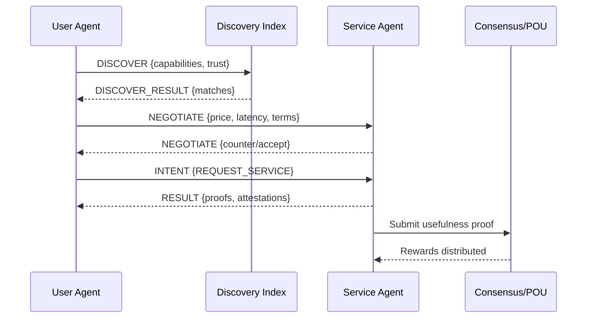

# Web4 Documentation Index

This index ties together Web4’s core concepts and points to the right deep dives.

## Start Here

- Unified overview: `docs/web4/unified.md` (pillars, mining, economics, privacy, mobile, feedback loop)
- Glossary and shared types: `docs/web4/GLOSSARY.md`

## Core Components

- POU (Proof of Usefulness) architecture: `docs/web4/POU.md`
- PoM (Proof of Memory) layer: `docs/web4/POM.md`
- Usefulness scoring algorithm: `docs/web4/algorithm.md`
- Transport (AINP v0.1): `docs/rfcs/001-SPEC.md`

## Quick Start (Conceptual)

```typescript
// Week 1: Mine usefulness locally
const usefulness = {
  memory: sqliteVec.store(vectors),
  compute: agent.solve(problem),
  validation: node.verify(proof)
}
const block = mine(usefulness)

// Month 2: Route intents over AINP
const packet = new UsefulPacket({
  intent: "find:solution",
  problem,
  reward: 100
})
await ainp.route(packet)
```

## Flow Diagram (AINP + POU)



## Contributing

- Keep terminology aligned with POU/usefulness.
- Reference `GLOSSARY.md` for shared types and terms.
- Link AINP message flows to `docs/rfcs/001-SPEC.md`.

## Whitepaper Build

- Source template: `docs/web4/WHITEPAPER.template.md`
- Build combined Markdown:
  - `python scripts/build_whitepaper.py --template docs/web4/WHITEPAPER.template.md --out docs/web4/WHITEPAPER.md`
- Optional PDF (requires pandoc/LaTeX):
  - `pandoc docs/web4/WHITEPAPER.md -o docs/web4/WHITEPAPER.pdf --from gfm --toc --pdf-engine=xelatex`
