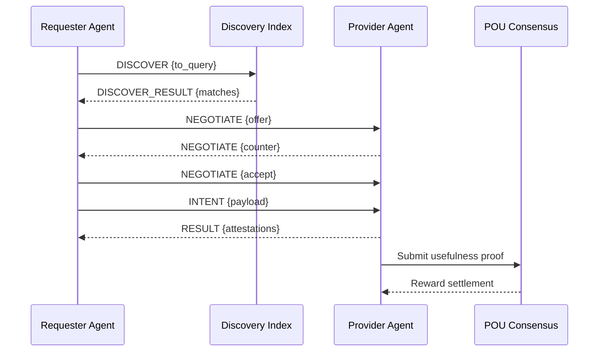

# Web4: Proof of Usefulness — Whitepaper (v0.1)

> This whitepaper assembles the unified architecture with key sections from POU and PoM. It is generated from source documents; do not edit this file’s generated counterpart directly.

## Core Thesis

Web4 is an intelligence layer where every computation, storage, and communication creates measurable usefulness. No wasted work. No empty blocks. Every cycle improves collective intelligence.

See also: `docs/web4/GLOSSARY.md` for terms and shared types.

## The Proof of Usefulness (PoU) Consensus

```typescript
interface ProofOfUsefulness {
  // Single consensus mechanism with multiple usefulness types
  usefulness: {
    memory: MemoryProof,      // Storing and serving vectors
    compute: ComputeProof,    // Solving problems
    routing: RoutingProof,    // Delivering packets via AINP
    learning: LearningProof,  // Improving models
    validation: ValidationProof // Verifying others' usefulness
  },
  
  // Unified scoring
  score(node: Node): number {
    return node.memory.impact * 0.3 +
           node.compute.solutions * 0.3 +
           node.routing.efficiency * 0.2 +
           node.learning.improvements * 0.1 +
           node.validation.accuracy * 0.1
  },
  
  // Single mining process
  async mine(): Promise<Block> {
    const useful = await this.performUsefulWork()
    const proof = await this.generateProof(useful)
    const validation = await this.network.validate(proof)
    return this.createBlock(useful, proof, validation)
  }
}
```

## The Three Pillars of Web4

### 1. AINP - The Semantic Network Layer
```typescript
interface AINP {
  // Packets route by meaning, not address
  routing: {
    address: SemanticAddress,    // What, not where
    intent: Intent,              // Goal, not data
    path: IntelligentRoute      // Self-optimizing
  },
  
  // Every packet potentially useful
  packet: UsefulPacket = {
    problem?: Problem,          // Needs solving
    memory?: Vector,           // Needs storing
    compute?: Task,           // Needs processing
    reward: TokenAmount       // Pays for usefulness
  }
}
```

### 2. Distributed Memory Layer
```typescript
interface MemoryLayer {
  // Every device is a memory node
  node: {
    vectors: LocalVectorDB,     // SQLite-vec/pgvector-lite
    capacity: "100MB-10GB",     // User controlled
    specialty: SemanticCluster  // Natural specialization
  },
  
  // Memories create usefulness
  useful: {
    store: Vector => TokenReward,
    retrieve: Query => TokenReward,
    improve: Pattern => TokenReward
  }
}
```

### 3. Compute Layer
```typescript
interface ComputeLayer {
  // Every agent can solve problems
  agent: {
    capabilities: Capability[],
    reputation: UsefulnessScore,
    specialization: Domain[]
  },
  
  // Problems are opportunities
  problems: {
    pool: ProblemPool,         // Global problem market
    routing: SemanticMatcher,  // Match problems to solvers
    validation: OutcomeProof   // Verify solution usefulness
  }
}
```

## The Proof of Usefulness (POU) Consensus Mechanism

```typescript
interface ProofOfUsefulness {
  // Instead of mining, agents solve real problems
  challenge: {
    type: "REAL_WORLD_PROBLEM",
    requester: AgentDID,
    problem: SemanticProblem,
    bounty: TokenAmount,
    urgency: number,
    impact: ImpactMetrics
  },
  
  // Solutions are verified by outcomes, not computation
  solution: {
    approach: SemanticSolution,
    execution: ExecutionProof,
    outcome: MeasuredOutcome,
    beneficiaries: Agent[],
    improvementDelta: number  // Measurable improvement
  },
  
  // Consensus from those actually served (usefulness attested)
  validation: {
    beneficiarySignatures: Signature[],
    impactVerification: ZKProof,
    outcomeOracle: DecentralizedOracle,
    timeLockedVerification: FutureProof  // Verify impact over time
  }
}
```

## Web4 Architecture Layers

See `docs/web4/GLOSSARY.md` for shared terms and types.

### 1. Identity Layer: Capability-Based Identity

```typescript
interface Web4Identity {
  // Identity is what you can do, not just who you are
  did: string,
  
  capabilities: {
    proven: Capability[],        // What you've demonstrably done
    claimed: Capability[],       // What you claim you can do
    learning: Capability[],      // What you're learning to do
    teaching: Capability[]       // What you can teach others
  },
  
  usefulnessHistory: {
    problemsSolved: ProblemHash[],
    agentsServed: AgentDID[],
    totalImpact: ImpactMetrics,
    specializations: Domain[]
  },
  
  reputation: {
    usefulness: number,         // How useful you are
    reliability: number,         // How consistently you deliver
    innovation: number,          // Novel solutions provided
    teaching: number            // How well you improve others
  },
  
  // Agents can stake reputation, not just tokens
  reputationStake: {
    amount: number,
    locked: boolean,
    slashingConditions: Condition[]
  }
}
```

### 2. Problem Market: The Core of Web4

```typescript
class ProblemMarket {
  // Problems are the fundamental unit of value
  interface Problem {
    semantic: SemanticDescription,
    urgency: number,
    impact: ImpactEstimate,
    bounty: TokenAmount,
    requiredCapabilities: Capability[],
    
    // Problems can be composed/decomposed
    subProblems?: Problem[],
    parentProblem?: ProblemHash,
    
    // Problems learn from solutions
    previousAttempts: SolutionAttempt[],
    learnings: Learning[]
  }
  
  // Automatic problem routing via AINP
  async routeProblem(problem: Problem): Promise<CapableAgent[]> {
    return await this.ainp.semanticRoute({
      intent: "find:capable_solvers",
      problem: problem,
      minCapabilityMatch: 0.8
    })
  }
  
  // Problems can evolve
  evolveProblem(problem: Problem, feedback: Feedback): Problem {
    return {
      ...problem,
      semantic: this.refineSemantics(problem.semantic, feedback),
      requiredCapabilities: this.updateCapabilities(problem, feedback)
    }
  }
}
```

### 3. Solution Consensus: Multi-Phase Validation

```typescript
interface SolutionConsensus {
  phases: {
    // Phase 1: Immediate beneficiary confirmation
    beneficiaryPhase: {
      signature: Signature,
      initialSatisfaction: number,
      escrowRelease: Partial<TokenAmount>
    },
    
    // Phase 2: Peer validation
    peerPhase: {
      validators: UsefulnessAgent[],  // Selected by usefulness score
      technicalValidation: boolean,
      innovationScore: number,
      escrowRelease: Partial<TokenAmount>
    },
    
    // Phase 3: Outcome verification (time-delayed)
    outcomePhase: {
      duration: TimeSpan,
      metrics: OutcomeMetrics,
      longTermImpact: number,
      finalRelease: TokenAmount,
      bonusPool: TokenAmount  // For exceptional long-term impact
    },
    
    // Phase 4: Learning extraction
    learningPhase: {
      patternExtracted: Pattern,
      modelImprovement: ModelDelta,
      distributedLearning: NetworkLearning
    }
  }
}
```

### 4. The Usefulness-to-Earn Economy

```typescript
class Web4Economy {
  // Multiple ways to earn by being useful
  earningMechanisms: {
    directUsefulness: {
      solve(problem: Problem): TokenAmount,
      assist(agent: Agent): TokenAmount,
      teach(capability: Capability): TokenAmount
    },
    
    validation: {
      validateSolution(solution: Solution): TokenAmount,
      verifyOutcome(outcome: Outcome): TokenAmount,
      improveModel(model: Model): TokenAmount
    },
    
    infrastructure: {
      routeIntent(intent: Intent): TokenAmount,      // AINP routing
      storeKnowledge(knowledge: Knowledge): TokenAmount,
      provideCompute(compute: ComputeUnit): TokenAmount
    },
    
    innovation: {
      createCapability(capability: Capability): TokenAmount,
      solveUnsolvable(problem: UnsolvedProblem): TokenAmount,
      inventPattern(pattern: Pattern): TokenAmount
    }
  },
  
  // Automatic market making for usefulness
  priceDiscovery: {
    async priceUsefulness(problem: Problem): Promise<TokenAmount> {
      const urgency = problem.urgency
      const impact = problem.impact
      const difficulty = await this.estimateDifficulty(problem)
      const supply = await this.findCapableAgents(problem)
      
      return this.curve.calculate(urgency, impact, difficulty, supply)
    }
  },
  
  // Reputation affects earnings
  reputationMultiplier(agent: Agent): number {
    return 1 + (agent.reputation.usefulness * 0.5) + 
           (agent.reputation.innovation * 0.3) +
           (agent.reputation.teaching * 0.2)
  }
}
```

### 5. Collective Intelligence Layer

```typescript
class CollectiveIntelligence {
  // The network gets smarter with every usefulness transaction
  interface NetworkLearning {
    // Patterns discovered from successful useful actions
    patterns: Map<ProblemType, SolutionPattern>,
    
    // Capability evolution
    capabilities: {
      emerged: Capability[],      // New capabilities discovered
      composed: Capability[],     // Capabilities created by combination
      obsoleted: Capability[]     // No longer needed
    },
    
    // Model improvements
    models: {
      base: Model,
      deltas: ModelDelta[],
      federated: FederatedLearning,
      consensus: ModelConsensus
    }
  }
  
  // Distributed learning from every usefulness transaction
  async learnFromUsefulness(usefulness: Usefulness): Promise<Learning> {
    // Extract patterns
    const pattern = await this.patternExtractor.extract(usefulness)
    
    // Update global model
    const modelDelta = await this.modelUpdater.update(usefulness)
    
    // Distribute learning to relevant agents
    await this.distributor.propagate(pattern, modelDelta)
    
    // Reward learning contribution
    return {
      pattern,
      modelDelta,
      reward: this.calculateLearningReward(pattern, modelDelta)
    }
  }
  
  // Agents can query collective knowledge
  async queryCollective(query: SemanticQuery): Promise<Knowledge> {
    const relevantPatterns = await this.patterns.search(query)
    const aggregatedKnowledge = await this.aggregator.combine(relevantPatterns)
    return this.synthesizer.synthesize(aggregatedKnowledge)
  }
}
```

### 6. Governance Through Usefulness

```typescript
interface Web4Governance {
  // Voting power from usefulness, not token holding
  votingPower(agent: Agent): number {
    return agent.usefulnessHistory.totalImpact * 
           agent.reputation.usefulness *
           Math.log(agent.usefulnessHistory.agentsServed.length)
  },
  
  // Proposals must demonstrate usefulness
  proposal: {
    expectedUsefulness: ImpactMetrics,
    beneficiaries: Agent[],
    capabilityImprovement: Capability[],
    validationMethod: ValidationMethod,
    
    // Proposals can be tested first
    testnet: {
      trial: TrialRun,
      metrics: TrialMetrics,
      feedback: Feedback[]
    }
  },
  
  // Automatic governance through outcomes
  automaticGovernance: {
    // Successful patterns become protocol
    promotePattern(pattern: Pattern): Protocol,
    
    // Unsuccessful patterns are deprecated
    deprecate(pattern: Pattern): void,
    
    // The network self-governs based on usefulness metrics
    adjust(metrics: NetworkMetrics): GovernanceUpdate
  }
}
```

### 7. Native AINP Integration

```typescript
class Web4Network {
  // Every Web4 node speaks AINP natively
  protocol: AINP = {
    // Problems and solutions route semantically
    routing: SemanticRouting,
    
    // Agents negotiate usefulness terms
    negotiation: UsefulnessNegotiation,
    
    // Built-in usefulness economics
    economics: UsefulnessEconomics
  },
  
  // Network topology optimizes for usefulness
  topology: {
    // Cluster agents by complementary capabilities
    clustering: CapabilityCluster[],
    
    // Route problems to most capable clusters
    routing: ProblemRouter,
    
    // Dynamics based on usefulness patterns
    evolution: TopologyEvolution
  },
  
  // Usefulness requests as first-class packets
  packet: UsefulnessPacket = {
    problem: Problem,
    urgency: number,
    bounty: TokenAmount,
    requiredCapabilities: Capability[],
    
    // Packets learn from journey
    journey: {
      attempts: SolutionAttempt[],
      learnings: Learning[],
      routeOptimization: Route[]
    }
  }
}
```

## AINP v0.1 Protocol Mapping

- Discovery: POU uses AINP `DISCOVER`/`DISCOVER_RESULT` to find capable agents (capabilities + trust).
- Negotiation: Terms set via `NEGOTIATE` (`price`, `latency_ms`, `terms.incentive_split`, `escrow_required`).
- Intent: Work requests sent as `INTENT` (e.g., `REQUEST_SERVICE`, `SUBMIT_INFO`).
- Result: Outcomes reported via `RESULT` with attestations (VCs, proofs) and metering for rewards.
- Security: All envelopes signed (Ed25519); TTL, replay protection, and rate limits enforced.

See `docs/rfcs/001-SPEC.md` for full envelope, QoS, error codes, and replay semantics.

### End-to-End Flow (Mermaid)



## Economic Model: Usefulness = Value

```typescript
class UsefulnessEconomy {
  // Price discovery through usefulness markets
  markets: {
    memory: {
      store: (size: bigint, duration: number) => TokenAmount,
      retrieve: (complexity: number) => TokenAmount
    },
    compute: {
      solve: (problem: Problem) => TokenAmount,
      validate: (solution: Solution) => TokenAmount  
    },
    network: {
      route: (distance: SemanticDistance) => TokenAmount,
      bandwidth: (throughput: number) => TokenAmount
    }
  },
  
  // Reputation multiplies earnings
  reputation(node: Node): number {
    return Math.log(node.usefulnessHistory) * 
           node.reliability * 
           node.specialization.depth
  },
  
  // Compound usefulness
  compound: {
    // Memory that enables solutions earns from both
    memoryToSolution: (memory: Memory, solution: Solution) => TokenAmount,
    
    // Routing that enables solutions earns from both
    routeToSolution: (route: Route, solution: Solution) => TokenAmount,
    
    // Validation that improves accuracy earns bonus
    validationImprovement: (validation: Validation) => TokenAmount
  }
}
```

## Governance & Safety Summary

- Reputation: `usefulness` with decay and dimensions (reliability, innovation, teaching) informs routing and rewards.
- Anti‑abuse: Rate limits, payload caps, duplicate `id` rejection, and capability attestations (VCs).
- Privacy: Optional homomorphic operations and ZK proofs for memory/compute/routing/learning claims.
- Escrow & Settlement: Negotiation may require escrow before ACCEPT; disputes pause payout and affect reputation.

## Proof of Memory (PoM)

## Architecture Overview

```typescript
interface DecentralizedMemory {
  // Every device runs a lightweight vector DB
  localNode: {
    database: "pgvector-mobile" | "sqlite-vec" | "duckdb",
    capacity: bigint,  // Available storage
    compute: ComputeUnit,  // For similarity search
    bandwidth: number,  // For sync/query
    uptime: number  // Reliability score
  },
  
  // Memories are sharded across devices
  distribution: {
    sharding: SemanticSharding,  // Shard by meaning, not hash
    replication: AdaptiveReplication,  // More replicas for important memories
    locality: EdgeLocality  // Keep related memories close
  },
  
  // Privacy-preserving vector storage
  privacy: {
    vectors: HomomorphicVectors,  // Encrypted but searchable
    owner: ZKProof,  // Prove ownership without revealing identity
    access: CapabilityToken  // Fine-grained access control
  }
}
```

## The Memory Mining System - Proof of Memory (PoM)

See `docs/web4/GLOSSARY.md` for shared terms and types.

```typescript
class ProofOfMemory {
  // Users mine by providing memory storage and retrieval
  interface MemoryMining {
    // Passive earning: Store vectors
    storage: {
      vectors: Vector[],
      sizeBytes: bigint,
      duration: TimeSpan,
      availability: number,  // Uptime percentage
      reward: TokenAmount
    },
    
    // Active earning: Serve queries
    retrieval: {
      query: VectorQuery,
      latency: number,
      accuracy: number,
      computeUsed: ComputeUnit,
      reward: TokenAmount
    },
    
    // Bonus earning: Improve memories
    enhancement: {
      deduplication: Vector[],  // Merge similar memories
      compression: CompressionRatio,  // Optimize storage
      indexing: IndexImprovement,  // Speed up search
      reward: TokenAmount
    }
  }
  
  // Consensus through memory verification
  consensus: {
    // Prove you're storing the vectors
    storageProof: MerkleProof,
    
    // Prove you can retrieve accurately
    retrievalChallenge: RandomVectorChallenge,
    
    // Prove memories are being used usefully
    usefulnessProof: MemoryImpactMetrics
  }
}
```

## Mobile Vector Database Architecture

```typescript
class MobileVectorNode {
  // Lightweight pgvector variant for phones
  database: {
    // Optimized for mobile constraints
    engine: "pgvector-lite",
    
    // Adaptive indexing
    index: {
      type: "HNSW" | "IVFFlat",  // Based on device capability
      dimensions: number,
      lists: number,  // Adaptive based on storage
      probes: number  // Adaptive based on compute
    },
    
    // Smart caching
    cache: {
      hot: Vector[],  // Frequently accessed
      warm: Vector[],  // Recently accessed
      cold: VectorReference[]  // Pointers to remote
    }
  }
  
  // Semantic sharding - store related memories
  sharding: {
    async assignShard(vector: Vector): Promise<ShardID> {
      // Device specializes in certain types of memories
      const specialty = await this.getDeviceSpecialty()
      const similarity = await this.computeSimilarity(vector, specialty)
      
      if (similarity > THRESHOLD) {
        return this.localShard
      } else {
        return await this.network.findBestShard(vector)
      }
    },
    
    // Devices naturally specialize
    specialization: {
      topics: EmbeddingCluster[],  // What this device knows about
      quality: number,  // How well it serves these topics
      reputation: number  // Track record
    }
  }
  
  // Efficient sync protocol
  sync: {
    // Delta sync only
    protocol: "CRDT-Vectors",
    
    // Semantic deduplication
    deduplicate(v1: Vector, v2: Vector): Vector | null {
      if (this.similarity(v1, v2) > 0.95) {
        return this.merge(v1, v2)
      }
      return null
    },
    
    // Gossip protocol for vector updates
    gossip: {
      peers: DeviceID[],
      interval: number,
      payload: VectorDelta
    }
  }
}
```

## Integration with Web4 Proof of Usefulness

```typescript
class MemoryUsefulness {
  // Memories that are useful earn more
  usefulMemory: {
    // Track which memories led to solutions
    impact: Map<MemoryID, UsefulnessScore>,
    
    // Reward memory providers when their memories are useful
    async rewardChain(solution: Solution): Promise<void> {
      const memoriesUsed = await this.traceMemories(solution)
      
      for (const memory of memoriesUsed) {
        const providers = await this.findProviders(memory)
        const reward = this.calculateMemoryReward(memory.impact)
        await this.distributeReward(providers, reward)
      }
    }
  }
  
  // Memories as knowledge requests
  memoryMarketplace: {
    // "I need memories about X"
    request: MemoryRequest,
    
    // "I have memories about X"  
    offer: MemoryOffer,
    
    // Automatic matching
    matching: SemanticMatcher
  }
}
```

## Why This Solves AI Memory at Scale

### 1. **Infinite Scalability**
- Every new phone adds storage capacity
- 5 billion phones × 1GB = 5 exabytes of vector storage
- Grows with adoption

### 2. **Economic Sustainability**
- Users earn passive income from unused phone storage
- Agents pay for memory they actually use
- Market pricing ensures efficiency

### 3. **Privacy Preserved**
- Homomorphic encryption allows search without decryption
- Users control their memory sovereignty
- Differential privacy for aggregates

### 4. **Edge Intelligence**
- Memories stay close to where they're needed
- Reduced latency for recall
- Semantic sharding improves relevance

### 5. **Collective Learning**
- Every interaction improves global memory
- Patterns emerge from distributed memories
- Network gets smarter over time

## Implementation Roadmap

### Phase 1: Mobile Vector DB (Month 1)
```typescript
// Start with simple SQLite vector extension
const mobileDB = new SqliteVec({
  dimensions: 1536,  // OpenAI embeddings
  maxVectors: 10000,  // ~40MB
  index: "flat"  // Simple to start
})
```

### Phase 2: P2P Memory Network (Month 2-3)
- Implement gossip protocol
- Basic sharding by semantic similarity
- Simple replication (3x)

### Phase 3: Privacy Layer (Month 4-5)
- Homomorphic vector operations
- Zero-knowledge proofs
- Differential privacy

### Phase 4: Economic Integration (Month 6)
- Memory marketplace
- Proof of Memory consensus
- Reward distribution

## Implementation Roadmap

### Month 1-2: Core POU Mechanism
```typescript
// Start with simple usefulness validation
const mvpPOU = {
  problem: SimpleProblem,
  solution: Solution,
  validation: BeneficiarySignature,
  reward: TokenAmount
}
```

### Month 3-4: AINP Integration
- Semantic routing for problems
- Agent negotiation protocol
- Usefulness packet implementation

### Month 5-6: Collective Learning
- Pattern extraction from useful actions
- Federated model updates
- Knowledge distribution

### Month 7-8: Economic Layer
- Usefulness pricing curves
- Reputation multipliers
- Multi-phase rewards

### Month 9-12: Ecosystem Growth
- Developer tools
- Agent frameworks
- Usefulness marketplaces
- Migration tools

## Why Web4 Wins

### Single Consensus, Multiple Paths
- Not PoW vs PoS vs POU - just Proof of Usefulness
- Mine by storing, computing, routing, or validating
- Everyone contributes based on their capabilities

### Economic Efficiency
- Every computation creates value
- No wasted energy on meaningless hashes
- Direct correlation: usefulness = rewards

### Scalability Through Distribution
- 5 billion phones = massive compute/memory
- Edge-first reduces latency
- Semantic routing reduces overhead

### Privacy Through Architecture
- Your data stays on your device
- Homomorphic operations preserve privacy
- Zero-knowledge proofs verify without revealing

## The Web4 Manifesto

**We declare Web4: The Useful Web**

1. **Every cycle counts** - No computation without purpose
2. **Every device contributes** - From phones to servers
3. **Every user earns** - Usefulness creates value
4. **Every interaction teaches** - Network learns constantly
5. **Every memory matters** - Collective intelligence emerges
6. **Every packet finds its way** - Semantic routing prevails
7. **Every problem is opportunity** - Challenges create rewards
8. **Every validation builds trust** - Consensus through usefulness
9. **Every moment improves** - Evolution is continuous
10. **Every human benefits** - Useful AI for all

## Appendix A: Glossary

# Web4 Glossary and Shared Types

This document defines common terms and lightweight shared types used across the Web4 docs. It aligns terminology for Proof of Usefulness (POU), Proof of Memory (PoM), and AINP.

## Glossary

- POU (Proof of Usefulness): Consensus based on useful work (compute, memory, routing, learning, validation) rather than pure hashing or stake.
- PoM (Proof of Memory): A specialized usefulness domain where devices store, serve, and improve vector memories.
- AINP (AI‑Native Network Protocol): Semantic transport for discovery, negotiation, intents, and results among agents. See `docs/rfcs/001-SPEC.md`.
- Usefulness Score: Weighted measure of a node/agent’s net contribution to the network across usefulness domains.
- Usefulness Agent: An agent eligible to participate in usefulness consensus (solve problems, provide memory, route, validate, or improve models) with identity (DID), capabilities, and reputation.
- Discovery Index: An AINP‑compatible index that matches capability queries to agents using embeddings and trust.
- Escrow: Budgeted funds reserved during negotiation and released upon successful `RESULT` with proofs.

## Shared Types (Conceptual)

These types provide a shared vocabulary. Formal scoring structures are defined in `docs/web4/algorithm.md`.

```typescript
// An agent participating in POU
interface UsefulnessAgent {
  did: string;                        // W3C DID
  capabilities: string[];             // Human-readable tags
  embeddingRef?: string;              // Pointer to embedding/capability VC
  reputation: {
    usefulness: number;               // 0–1 aggregate
    reliability: number;              // 0–1
    innovation: number;               // 0–1
  };
}

// High-level score used for selection/routing
interface UsefulnessScoreSummary {
  total: number;                      // 0–100+ scaled
  memory?: number;                    // 0–10 
  compute?: number;                   // 0–10
  routing?: number;                   // 0–10
  learning?: number;                  // 0–10
  validation?: number;                // 0–10
}

// Wire-level mapping reference
// For detailed scoring, see: docs/web4/algorithm.md (UsefulnessScore)
```

## Cross‑References

- Unified view: `docs/web4/unified.md`
- POU architecture: `docs/web4/POU.md`
- PoM layer: `docs/web4/POM.md`
- Scoring algorithm: `docs/web4/algorithm.md`
- Transport (AINP): `docs/rfcs/001-SPEC.md`
