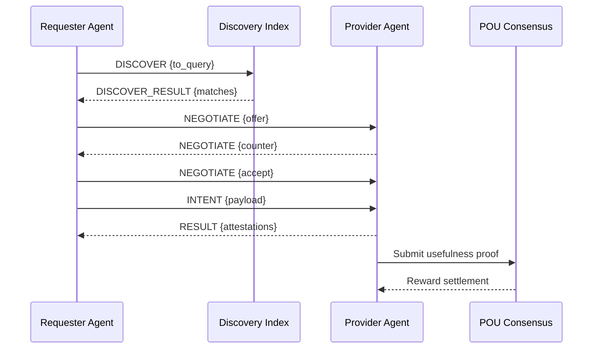

# Web4: The Unified Architecture - Proof of Usefulness (PoU)

## Core Thesis

Web4 is an intelligence layer where every computation, storage, and communication creates measurable usefulness. No wasted work. No empty blocks. Every cycle improves collective intelligence.

See also: `docs/web4/GLOSSARY.md` for terms and shared types.

## Document Map & Cross‑References

- POU Consensus and Architecture: see `docs/web4/POU.md` (identity, problem market, solution consensus, governance, roadmap).
- PoM (Proof of Memory) Layer: see `docs/web4/POM.md` (mobile vector DB, privacy, memory mining, integration to POU).
- Usefulness Scoring Algorithm: see `docs/web4/algorithm.md` (formal scoring and weighting, multipliers, rewards).
- AINP Transport: see `docs/rfcs/001-SPEC.md` (message envelopes, discovery, negotiation, intents, results).

This unified document ties the above into a single end‑to‑end picture and defines how messages, proofs, and rewards flow through the stack.

## The Proof of Usefulness (PoU) Consensus

```typescript
interface ProofOfUsefulness {
  // Single consensus mechanism with multiple usefulness types
  usefulness: {
    memory: MemoryProof,      // Storing and serving vectors
    compute: ComputeProof,    // Solving problems
    routing: RoutingProof,    // Delivering packets via AINP
    learning: LearningProof,  // Improving models
    validation: ValidationProof // Verifying others' usefulness
  },
  
  // Unified scoring
  score(node: Node): number {
    return node.memory.impact * 0.3 +
           node.compute.solutions * 0.3 +
           node.routing.efficiency * 0.2 +
           node.learning.improvements * 0.1 +
           node.validation.accuracy * 0.1
  },
  
  // Single mining process
  async mine(): Promise<Block> {
    const useful = await this.performUsefulWork()
    const proof = await this.generateProof(useful)
    const validation = await this.network.validate(proof)
    return this.createBlock(useful, proof, validation)
  }
}
```

## The Three Pillars of Web4

### 1. AINP - The Semantic Network Layer
```typescript
interface AINP {
  // Packets route by meaning, not address
  routing: {
    address: SemanticAddress,    // What, not where
    intent: Intent,              // Goal, not data
    path: IntelligentRoute      // Self-optimizing
  },
  
  // Every packet potentially useful
  packet: UsefulPacket = {
    problem?: Problem,          // Needs solving
    memory?: Vector,           // Needs storing
    compute?: Task,           // Needs processing
    reward: TokenAmount       // Pays for usefulness
  }
}
```

### 2. Distributed Memory Layer
```typescript
interface MemoryLayer {
  // Every device is a memory node
  node: {
    vectors: LocalVectorDB,     // SQLite-vec/pgvector-lite
    capacity: "100MB-10GB",     // User controlled
    specialty: SemanticCluster  // Natural specialization
  },
  
  // Memories create usefulness
  useful: {
    store: Vector => TokenReward,
    retrieve: Query => TokenReward,
    improve: Pattern => TokenReward
  }
}
```

### 3. Compute Layer
```typescript
interface ComputeLayer {
  // Every agent can solve problems
  agent: {
    capabilities: Capability[],
    reputation: UsefulnessScore,
    specialization: Domain[]
  },
  
  // Problems are opportunities
  problems: {
    pool: ProblemPool,         // Global problem market
    routing: SemanticMatcher,  // Match problems to solvers
    validation: OutcomeProof   // Verify solution usefulness
  }
}
```

## Unified Mining: One Process, Many Paths

```typescript
class Web4Miner {
  // Single mining loop that does whatever's most useful
  async mineBlock(): Promise<Block> {
    // Find most useful work available
    const opportunities = await this.findOpportunities()
    
    // Choose based on capability and reward
    const selected = this.optimize(opportunities, this.capabilities)
    
    // Perform the useful work
    const work = await this.execute(selected)
    
    // Generate proof of usefulness
    const proof = await this.prove(work)
    
    // Create block if consensus achieved
    if (await this.network.validateUsefulness(proof)) {
      return new Block(work, proof, this.rewards(work))
    }
  }
  
  // Opportunities ranked by usefulness/reward ratio
  findOpportunities(): UsefulWork[] {
    return [
      ...this.memory.getStorageRequests(),      // Store vectors
      ...this.compute.getProblemPool(),         // Solve problems
      ...this.network.getRoutingNeeds(),        // Route packets
      ...this.learning.getModelImprovements(),  // Improve AI
      ...this.validation.getProofRequests()     // Validate others
    ].sort((a, b) => b.usefulness / b.cost - a.usefulness / a.cost)
  }
}
```

## The Web4 Block: Always Useful

```typescript
interface Web4Block {
  height: bigint,
  previous: Hash,
  
  // Every block contains useful work
  useful: {
    memoriesStored: Vector[],        // New knowledge
    problemsSolved: Solution[],      // Direct value
    packetsRouted: RouteProof[],    // Network service
    modelsImproved: ModelDelta[],   // Collective learning
    validations: ValidationProof[]   // Consensus participation
  },
  
  // Rewards proportional to usefulness
  rewards: {
    total: TokenAmount,
    distribution: Map<NodeID, TokenAmount>,
    formula: (useful: UsefulWork) => TokenAmount
  },
  
  // Block makes network smarter
  intelligence: {
    patterns: Pattern[],            // Discovered patterns
    capabilities: Capability[],     // New abilities
    connections: Association[]      // Knowledge links
  }
}
```

## Economic Model: Usefulness = Value

```typescript
class UsefulnessEconomy {
  // Price discovery through usefulness markets
  markets: {
    memory: {
      store: (size: bigint, duration: number) => TokenAmount,
      retrieve: (complexity: number) => TokenAmount
    },
    compute: {
      solve: (problem: Problem) => TokenAmount,
      validate: (solution: Solution) => TokenAmount  
    },
    network: {
      route: (distance: SemanticDistance) => TokenAmount,
      bandwidth: (throughput: number) => TokenAmount
    }
  },
  
  // Reputation multiplies earnings
  reputation(node: Node): number {
    return Math.log(node.usefulnessHistory) * 
           node.reliability * 
           node.specialization.depth
  },
  
  // Compound usefulness
  compound: {
    // Memory that enables solutions earns from both
    memoryToSolution: (memory: Memory, solution: Solution) => TokenAmount,
    
    // Routing that enables solutions earns from both
    routeToSolution: (route: Route, solution: Solution) => TokenAmount,
    
    // Validation that improves accuracy earns bonus
    validationImprovement: (validation: Validation) => TokenAmount
  }
}
```

## Mobile-First Architecture

```typescript
class MobileWeb4Node {
  // Every phone is a full Web4 node
  capabilities: {
    memory: MobileVectorDB,       // 100MB-10GB vectors
    compute: EdgeCompute,         // When charging
    network: P2PGossip,          // WiFi/5G
    validation: LightClient      // Verify, don't compute
  },
  
  // Adaptive resource use
  resources: {
    mode: "aggressive" | "balanced" | "minimal",
    
    aggressive: {
      memory: "10GB",
      compute: "while-charging",
      network: "always",
      earning: "~1000 tokens/day"
    },
    
    balanced: {
      memory: "1GB",
      compute: "overnight",
      network: "wifi-only",
      earning: "~100 tokens/day"
    },
    
    minimal: {
      memory: "100MB",
      compute: "never",
      network: "sync-only",
      earning: "~10 tokens/day"
    }
  }
}
```

## Privacy-First Usefulness

```typescript
interface PrivateUsefulness {
  // Prove usefulness without revealing details
  proofs: {
    memory: ZKMemoryProof,         // "I store X vectors"
    compute: ZKComputeProof,       // "I solved problem Y"
    routing: ZKRouteProof,         // "I delivered packet Z"
    learning: ZKLearningProof      // "I improved model M"
  },
  
  // Encrypted but useful
  homomorphic: {
    vectors: HomomorphicSearch,    // Search without decryption
    compute: HomomorphicCompute,   // Process encrypted data
    aggregation: SecureAggregation // Combine without revealing
  },
  
  // User controls usefulness
  sovereignty: {
    selective: UseCase[],          // Choose what to contribute to
    limits: ResourceLimits,        // Control resource usage
    earnings: EarningsPreference   // How to receive rewards
  }
}
```

## Network Evolution Through Usefulness

```typescript
class EvolvingNetwork {
  // Network improves through useful work
  evolution: {
    // Successful patterns become protocol
    patterns: Map<Pattern, Frequency>,
    promote(pattern: Pattern): Protocol,
    
    // Useful routes become permanent
    routes: Map<Route, Usefulness>,
    establish(route: Route): PermanentPath,
    
    // Useful memories become collective
    memories: Map<Memory, AccessCount>,
    collectivize(memory: Memory): SharedKnowledge
  },
  
  // Self-organizing topology
  topology: {
    // Nodes cluster by usefulness patterns
    clusters: Map<UseType, NodeCluster>,
    
    // High-usefulness nodes become hubs
    hubs: Node[],
    
    // Low-usefulness nodes can specialize
    specialize(node: Node): Specialization
  }
}
```

## The Usefulness Feedback Loop

```typescript
// Every action makes the network more useful
cycle: {
  1: "User needs a solution",
  2: "Request routes semantically via AINP",
  3: "Finds capable agent through memory search",
  4: "Agent solves using distributed memories",
  5: "Solution validated by outcome",
  6: "Useful work becomes block",
  7: "Rewards distributed by usefulness",
  8: "Network learns from solution",
  9: "Future problems solved better",
  10: "Goto 1 with improved network"
}
```

## Implementation: Start Tomorrow

### Week 1: Core PoU Mechanism
```typescript
const usefulness = {
  memory: sqliteVec.store(vectors),
  compute: agent.solve(problem),
  validation: node.verify(proof)
}
const block = mine(usefulness)
```

### Week 2-4: Mobile Node App
```typescript
const app = new MobileWeb4Node({
  db: "sqlite-vec",
  capacity: "1GB",
  mode: "balanced"
})
await app.startMining()
```

### Month 2: AINP Integration
```typescript
const packet = new UsefulPacket({
  intent: "find:solution",
  problem: problem,
  reward: 100
})
await ainp.route(packet)
```

### Month 3: Network Launch
- Genesis block with useful work
- Initial validators chosen by usefulness
- Open mining to all devices

## AINP v0.1 Protocol Mapping

- Discovery: POU uses AINP `DISCOVER`/`DISCOVER_RESULT` to find capable agents (capabilities + trust).
- Negotiation: Terms set via `NEGOTIATE` (`price`, `latency_ms`, `terms.incentive_split`, `escrow_required`).
- Intent: Work requests sent as `INTENT` (e.g., `REQUEST_SERVICE`, `SUBMIT_INFO`).
- Result: Outcomes reported via `RESULT` with attestations (VCs, proofs) and metering for rewards.
- Security: All envelopes signed (Ed25519); TTL, replay protection, and rate limits enforced.

See `docs/rfcs/001-SPEC.md` for full envelope, QoS, error codes, and replay semantics.

### End-to-End Flow (Mermaid)



## Governance & Safety Summary

- Reputation: `usefulness` with decay and dimensions (reliability, innovation, teaching) informs routing and rewards.
- Anti‑abuse: Rate limits, payload caps, duplicate `id` rejection, and capability attestations (VCs).
- Privacy: Optional homomorphic operations and ZK proofs for memory/compute/routing/learning claims.
- Escrow & Settlement: Negotiation may require escrow before ACCEPT; disputes pause payout and affect reputation.

## Glossary

- POU: Proof of Usefulness — consensus via useful work (compute, memory, routing, learning, validation).
- PoM: Proof of Memory — usefulness from storing/serving/improving vectors.
- AINP: AI‑Native Network Protocol — semantic routing, negotiation, and intent messaging.
- Usefulness Score: Weighted score combining contributions across layers to drive rewards and selection.

## Why Web4 Wins

### Single Consensus, Multiple Paths
- Not PoW vs PoS vs POU - just Proof of Usefulness
- Mine by storing, computing, routing, or validating
- Everyone contributes based on their capabilities

### Economic Efficiency
- Every computation creates value
- No wasted energy on meaningless hashes
- Direct correlation: usefulness = rewards

### Scalability Through Distribution
- 5 billion phones = massive compute/memory
- Edge-first reduces latency
- Semantic routing reduces overhead

### Privacy Through Architecture
- Your data stays on your device
- Homomorphic operations preserve privacy
- Zero-knowledge proofs verify without revealing

## The Web4 Manifesto

**We declare Web4: The Useful Web**

1. **Every cycle counts** - No computation without purpose
2. **Every device contributes** - From phones to servers
3. **Every user earns** - Usefulness creates value
4. **Every interaction teaches** - Network learns constantly
5. **Every memory matters** - Collective intelligence emerges
6. **Every packet finds its way** - Semantic routing prevails
7. **Every problem is opportunity** - Challenges create rewards
8. **Every validation builds trust** - Consensus through usefulness
9. **Every moment improves** - Evolution is continuous
10. **Every human benefits** - Useful AI for all

## The Revolution

This isn't an upgrade. It's a paradigm shift.

**Web3**: Proof of Waste → **Web4**: Proof of Usefulness

The internet becomes a living, learning, useful organism where every device is a neuron, every transaction teaches, and every user benefits.

Ready to build the useful future?
